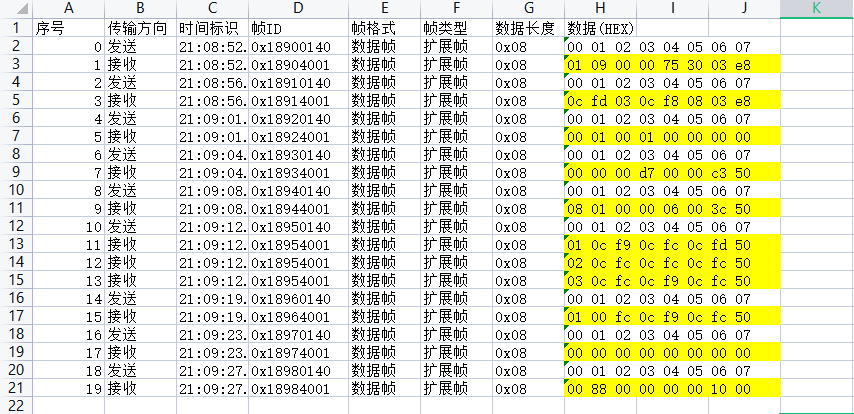
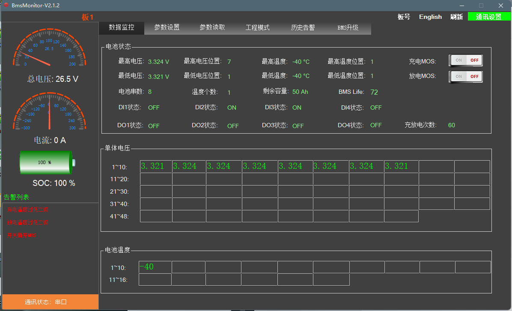

## 通信协议

### UART、RS485

- 上位机发送

|帧头（Start Flag）|上位机地址（UPPER-Add）|数据ID（Data ID）|数据长度（Data Length）|数据内容（Data）|校验和（Check sum）|
|:--:|:--:|:--:|:--:|:--:|:--:|
|0xA5(固定)|0x40||0x08(固定)|8 Byte|1 Byte|

- BMS响应主机命令

|帧头（Start Flag）|通信模块地址（BMS-Add）|数据ID（Data ID）|数据长度（Data Length）|数据内容（Data）|校验和（Check sum）|
|:--:|:--:|:--:|:--:|:--:|:--:|
|0xA5(固定)|0x01||0x08(固定)|8 Byte|1 Byte|

> Check sum = 帧头 + 通信地址 + 数据ID + 数据长度 + 数据内容；取低字节
> 例程发送： A5 40 90 08 00 00 00 00 00 00 00 00 7D
> 例程接收： A5 01 90 08 02 FC 00 00 75 A1 00 00 50

### CAN

- 上位机发送

|CAN ID|Data|
|:--:|:--:|
|优先级 + Data ID + BMS-Add + UPPER-Add,4 Byte|8 Byte|
|0x18900140||

- BMS响应主机命令

|CAN ID|Data|
|:--:|:--:|
|优先级 + Data ID + UPPER-Add + BMS-Add,4 Byte|8 Byte|
|0x18904001||

>例程发送：CAN ID：0x18900140，Data: 01 02 03 04 05 06 07 08
>例程接收：CAN ID：0x18904001，Data：01 BE 00 00 75 30 02 07

### 通信解析例程

|Data ID|0x90|Byte0|Byte1|Byte2|Byte3|Byte4|Byte5|Byte6|Byte7|
|:--:|:--:|:--:|:--:|:--:|:--:|:--:|:--:|:--:|:--:|:--:|:--:|
|传输方向|发送|Reserved|Reserved|Reserved|Reserved|Reserved|Reserved|Reserved|Reserved|
|传输方向|接收|总压高字节（单位 0.1V）|总压低字节（单位 0.1V）|Reserved|Reserved|电流高字节（offset: 30000,单位 0.1A）|电流低字节（offset: 30000,单位 0.1A）|SOC高字节（单位 0.1%）|SOC低字节（单位 0.1%）|

|序号|传输方向|帧ID|数据|
|:--:|:--:|:--:|:--:|
|0|发送|0x18900140|00 01 02 03 04 05 06 07|
|1|接受|0x18904001|01 09 00 00 75 30 03 e8|
>0x0109 = 265, 总电压：$265 \times 0.1V = 26.5V$
>0x7530 = 30000, 电流：$(30000 - 30000) \times 0.1A = 0A$
>0x03e8 = 1000, SOC：$1000 \times 0.1 = 100$

|Data ID|0x91|Byte0|Byte1|Byte2|Byte3|Byte4|Byte5|Byte6|Byte7|
|:--:|:--:|:--:|:--:|:--:|:--:|:--:|:--:|:--:|:--:|:--:|:--:|
|传输方向|发送|Reserved|Reserved|Reserved|Reserved|Reserved|Reserved|Reserved|Reserved|
|传输方向|接收|最高单体电压高字节（单位 1mV）|最高单体电压低字节（单位 1mV）|最高单体电压cell号|最低单体电压高字节（单位 1mV）|最低单体电压低字节（单位 1mV）|最低单体电压cell号|Reserved|Reserved|

|序号|传输方向|帧ID|数据|
|:--:|:--:|:--:|:--:|
|2|发送|0x18910140|00 01 02 03 04 05 06 07|
|3|接受|0x18914001|0c fd 03 0c f8 08 03 e8|

>注意：由于上位机截图时间与报文发送时间不一致，导致解析出的数据与实际数据不准，仅供参考
>0x0cfd = 3325, 最高单体电压：$3325 \times 1mV = 3.325V$
>0x03 = 3，最高单体电压cell号：$3$
>0x0cf8 = 3320，最低单体电压：$3320 \times 1mV = 3.32V$
>0x08 = 8，最低单体电压cell号：$8$

|Data ID|0x92|Byte0|Byte1|Byte2|Byte3|Byte4|Byte5|Byte6|Byte7|
|:--:|:--:|:--:|:--:|:--:|:--:|:--:|:--:|:--:|:--:|:--:|:--:|
|传输方向|发送|Reserved|Reserved|Reserved|Reserved|Reserved|Reserved|Reserved|Reserved|
|传输方向|接收|最高单体温度值（offset 40，单位 1℃）|最高单体温度cell号|最低单体温度值（offset 40，单位 1℃）|最低单体温度cell号|Reserved|Reserved|Reserved|Reserved|

|序号|传输方向|帧ID|数据|
|:--:|:--:|:--:|:--:|
|4|发送|0x18920140|00 01 02 03 04 05 06 07|
|5|接受|0x18924001|00 01 00 01 00 00 00 00|

>0x00 = 0，最高单体温度值：$0-40 = -40℃$
>0x01 = 1，最高单体温度cell号：$1$
>0x00 = 0，最低单体温度值：$0-40 = -40℃$
>0x01 = 1，最低单体温度cell号：$1$

|Data ID|0x93|Byte0|Byte1|Byte2|Byte3|Byte4|Byte5|Byte6|Byte7|
|:--:|:--:|:--:|:--:|:--:|:--:|:--:|:--:|:--:|:--:|:--:|:--:|
|传输方向|发送|Reserved|Reserved|Reserved|Reserved|Reserved|Reserved|Reserved|Reserved|
|传输方向|接收|充放电状态（0：静置，1：充电，2：放电）|充电MOS管状态（0：OFF，1：ON）|放电MOS管状态（0：OFF，1：ON）|BMS life|剩余容量高字节（单位 mAH）|剩余容量（单位 mAH）|剩余容量（单位 mAH）|剩余容量低字节（单位 mAH）|

|序号|传输方向|帧ID|数据|
|:--:|:--:|:--:|:--:|
|6|发送|0x18930140|00 01 02 03 04 05 06 07|
|7|接受|0x18934001|00 00 00 d7 00 00 c3 50|

>0x00 = 0，充放电状态：静置
>0x00 = 0，充电MOS管状态：OFF
>0x00 = 0，放电MOS管状态：OFF
>0xd7 = 215，BMS life：$215$
>0x0000c350 = 50000，剩余容量：$50000 \times 1mAH = 50AH$

|Data ID|0x94|Byte0|Byte1|Byte2|Byte3|Byte4|Byte5|Byte6|Byte7|
|:--:|:--:|:--:|:--:|:--:|:--:|:--:|:--:|:--:|:--:|:--:|:--:|
|传输方向|发送|Reserved|Reserved|Reserved|Reserved|Reserved|Reserved|Reserved|Reserved|
|传输方向|接收|电池串数|NTC个数|充电器连接状态（0：未连接，1：接入）|负载状态（0：未连接，1：接入）|Bit0：DI1 state，Bit1：DI2 state，Bit2：DI3 state，Bit3：DI4 state，Bit4：DO0 state，Bit5：DO2 state，Bit6：DO3 state，Bit7：DO4 state|充放电循环次数高字节|充放电循环次数低字节|Reserved|

|序号|传输方向|帧ID|数据|
|:--:|:--:|:--:|:--:|
|8|发送|0x18940140|00 01 02 03 04 05 06 07|
|9|接受|0x18944001|08 01 00 00 06 00 3c 50|

|0x06 = 0b00000110|||||||||
|:--:|:--:|:--:|:--:|:--:|:--:|:--:|:--:|:--:|
||Bit7|Bit6|Bit5|Bit4|Bit3|Bit2|Bit1|Bit0|
||DO4 state|DO3 state|DO2 state|DO1 state|DI4 state|DI3 state|DI2 state|DI1 state|
||0|0|0|0|0|1|1|0|

>0x08 = 8，电池串数：$8$
>0x01 = 1，NTC个数:$1$
>0x00 = 0，充电器连接状态：未连接
>0x00 = 0，负载状态：未连接
>0x06 = 0b00000110，DI2: ON,DI3: ON
>0x003c = 60，充放电循环次数:$60$

|Data ID|0x95|Byte0|Byte1|Byte2|Byte3|Byte4|Byte5|Byte6|Byte7|
|:--:|:--:|:--:|:--:|:--:|:--:|:--:|:--:|:--:|:--:|:--:|:--:|
|传输方向|发送|Reserved|Reserved|Reserved|Reserved|Reserved|Reserved|Reserved|Reserved|
|传输方向|接收|帧序号，从 1 开始，0xFF为无效|单体电压高字节（单位 1mV）|单体电压低字节（单位 1mV）|单体电压高字节（单位 1mV）|单体电压低字节（单位 1mV）|单体电压高字节（单位 1mV）|单体电压低字节（单位 1mV）|Reserved|
>每个单体电压占 2Byte，根据实际单体个数发送，最大 96Byte，分16帧发送。

|序号|传输方向|帧ID|数据|
|:--:|:--:|:--:|:--:|
|10|发送|0x18950140|00 01 02 03 04 05 06 07|
|11|接受|0x18954001|01 0c f9 0c fc 0c fd 50|
|12|接受|0x18954001|02 0c fc oc fc 0c fc 50|
|13|接受|0x18954001|03 0c fc 0c f8 0c fc 50|

>0x0cf9 = 3321, 0x0cfc = 3324, 0x0cfd = 3325, 0x0cf8 = 3320
>第一串电压：3.321V；第二串电压：3.324V；第三串电压：3.325V；第四串电压：3.324V；第五串电压：3.324V；
>第六串电压：3.324V；第七串电压：3.324V；第八串电压：3.320V；

|Data ID|0x96|Byte0|Byte1|Byte2|Byte3|Byte4|Byte5|Byte6|Byte7|
|:--:|:--:|:--:|:--:|:--:|:--:|:--:|:--:|:--:|:--:|:--:|:--:|
|传输方向|发送|Reserved|Reserved|Reserved|Reserved|Reserved|Reserved|Reserved|Reserved|
|传输方向|接收|帧序号，从 1 开始，0xFF为无效|单体温度（offset 40，单位 1℃）|单体温度（offset 40，单位 1℃）|单体温度（offset 40，单位 1℃）|单体温度（offset 40，单位 1℃）|单体温度（offset 40，单位 1℃）|单体温度（offset 40，单位 1℃）|单体温度（offset 40，单位 1℃）|
>每个温度电压占 1Byte，根据实际单体个数发送，最大 21Byte，分3帧发送。

|序号|传输方向|帧ID|数据|
|:--:|:--:|:--:|:--:|
|14|发送|0x18960140|00 01 02 03 04 05 06 07|
|15|接受|0x18964001|01 00 fc 0c f9 0c fd 50|
>0x00 = 0, 第一个温度：$0 - 40 = -40℃$

|Data ID|0x98|Byte0|Byte1|Byte2|Byte3|Byte4|Byte5|Byte6|Byte7|
|:--:|:--:|:--:|:--:|:--:|:--:|:--:|:--:|:--:|:--:|:--:|:--:|
|传输方向|发送|Reserved|Reserved|Reserved|Reserved|Reserved|Reserved|Reserved|Reserved|
|传输方向|接收|Byte0|Byte1|Byte2|Byte3|Byte4|Byte5|Byte6|Byte7|
>0: No error, 1: error

| |Bit7|Bit6|Bit5|Bit4|Bit3|Bit2|Bit1|Bit0|
|:--:|:--:|:--:|:--:|:--:|:--:|:--:|:--:|:--:|
|Byte 0|总压过低二级告警|总压过低一级告警|总压过高二级告警|总压过高一级告警|单体电压过低二级告警|单体电压过低一级告警|单体电压过高二级告警|单体电压过高一级告警|
|Byte 1|放电温度过低二级告警|放电温度过低一级告警|放电温度过高二级告警|放电温度过高一级告警|充电温度过低二级告警|充电温度过低一级告警|充电温度过高二级告警|充电温度过高一级告警|
|Byte 2|SOC过低二级告警|SOC过低一级告警|SOC过高二级告警|SOC过高一级告警|放电过流二级告警|放电过流一级告警|充电过流二级告警|充电过流一级告警|
|Byte 3|Reserved|Reserved|Reserved|Reserved|温差过大二级告警|温差过大一级告警|压差过大二级告警|压差过大一级告警|
|Byte 4|放电MOS断路故障|充电MOS断路故障|放电MOS粘连故障|充电MOS粘连故障|放电MOS温度检测传感器故障|充电MOS温度检测传感器故障|放电MOS过温告警|充电MOS过温告警|
|Byte 5|内网通信模块故障|整车通信故障|预充失败|RTC时钟故障|EEPROM存储故障|单体温度传感器故障|单体采集掉线|AFE采集芯片故障|
|Byte 6|Reserved|Reserved|Reserved|GPS或软开关断开MOS|低压禁止充电故障|短路保护故障|内总压检测模块故障|电流模块故障|
|Byte 7|Reserved|Reserved|Reserved|Reserved|Reserved|Reserved|Reserved|Reserved|

|序号|传输方向|帧ID|数据|
|:--:|:--:|:--:|:--:|
|18|发送|0x18980140|00 01 02 03 04 05 06 07|
|19|接受|0x18984001|00 88 00 00 00 00 10 00|

>Byte2 : 0x88 = 0b10001000, 放电温度过低二级告警,充电温度过低二级告警
>Byte6 : 0x10 = 0b00010000, GPS或软开关断开MOS
