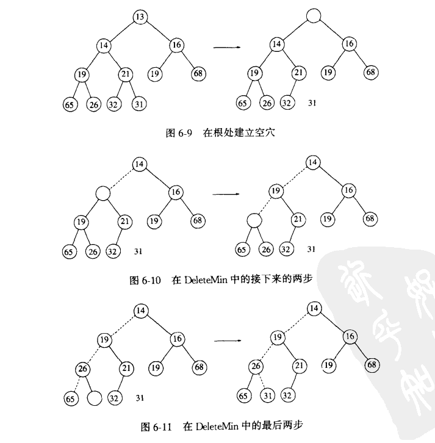

# 堆

##

### 二插数--堆

- 堆是一颗被完全填满的二叉树，有可能例外是在底层，底层上的元素从左到右填入。这样的树称为完全二叉树。因为完全二叉树很有规律，所以它可以用一个数组表示而不需要指针。
- 对于数组中的任一位置 i 上的元素，其左儿子在位置 2i 上，右儿子在位置 2i+1 上，它的父节点在 [i/2]上。因此不仅不需要指针，而且遍历该树所需要的操作也即简单。

|  | A | B | C | D | E | F | G | H | I | J |  |  |  | |
| :--: | :--: | :--: | :--: | :--: | :--: | :--: | :--: | :--: | :--: | :--: | :--: | :--: | :--: | :--: |
|0|1|2|3|4|5|6|7|8|9|10|11|12|13

