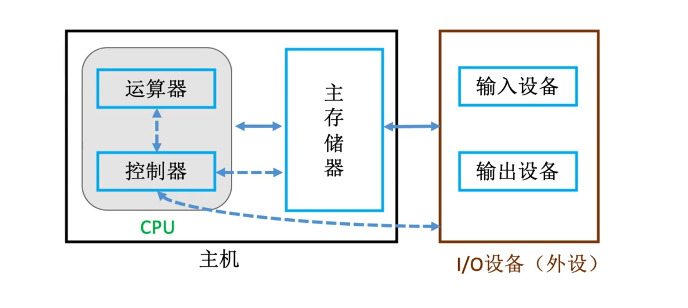
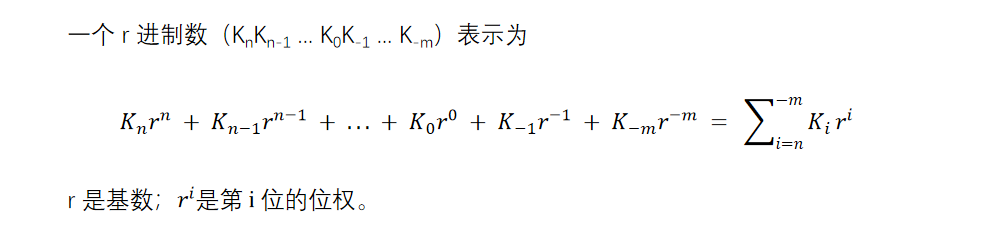
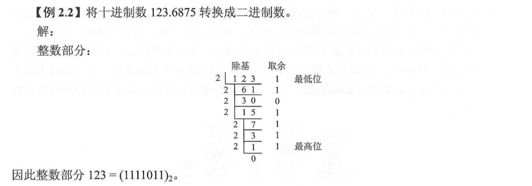
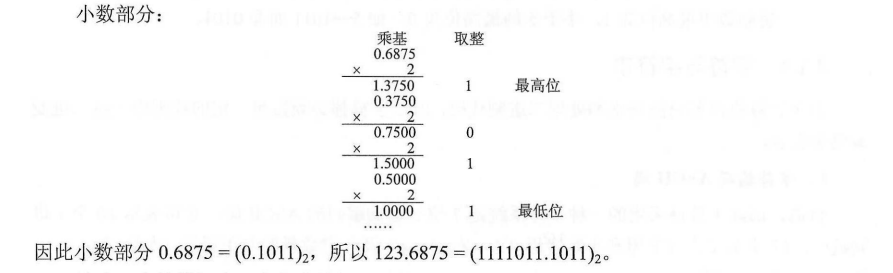

## 数据的表示与运算

---
现代计算机以存储器为中心，使I/O操作尽可能地绕过CPU，直接在I/O设备和存储器之间完成，以提高系统的整体运行效率，其结构如图

- 主存储器：用来存放程序与数据。(存储器分为主存储器和辅助存储器，CPU 能够直接访问的存储器是主存储器，辅助存储器用于帮助主存储器记忆更多的信息，辅助存储器中的信息必须调入主存后，才能为 CPU 所访问)。
- 运算器：是计算机的执行部件，用于进行算术运算和逻辑运算。算术运算是按算术运算规则进行的运算，如加、减、乘、除；逻辑运算包括与、或、非、异或、比较、移位等运算。运算器的核心是算术逻辑单元（Arithmetic and Logical Unit, ALU）。运算器包含若干通用寄存器，用于暂存操作数和中间结果，如累加器（ACC）、乘商寄存器（MQ）、操作数寄存器（X）、变址寄存器（IX）、基址寄存器（BR）等，其中前 3 个寄存器是必须有的。运算器内还有程序状态寄存器（PSW），也称标志寄存器，用于存放 ALU 运算得到的一些标志信息或处理机的状态信息，如结果是否溢出、有无产生进位或借位、结果是否为负等。
- 控制器：是计算机的指挥中心，由其“指挥”各部件自动协调地进行工作。控制器由程序计数器（PC）、指令寄存器（IR）和控制单元（CU）组成。
- 输入设备：将程序和数据以机器所能识别和接受的信息形式输入计算机。
- 输出设备：将计算机处理的结果以人们所能接受的形式或其他系统要求的信息形式输出。

---

### 数制与编码

#### **进位计数制**

- 进位计数法是一种计数的方法。常用的进位计数法有十进制、二进制、八进制、十六进制等。十进制数是日常生活中最常用的，而计算机通常使用二进制数、八进制数和十六进制数。
- 在进位计数法中，每个数位所用到的不同数码的个数为计数。十进制的计数为10（0 ~ 9），每个数位计满 10 就向高位进位，即 “逢十进一”。
- 十进制数 101，其个位的 1 显然与百位的 1 所表示的数值是不同的。每个数码所表示的数值等于改数码本身乘以一个与它所在数位有关的常数，这个常数成为位权。一个进位数的数值大小就是它各位数码按权相加。

- 二进制。计算机中用得最多的是基数为2的计数制，即二进制。二进制只有0和1两种数字符号，计数 “逢二进一”。
- 八进制。八进制作为二进制的一种书写形式，其基数为 8，有 0~7 共 8 个不同的数字符号，计数 “逢八进一”。因为 r = 8 = 2^3，所以只要把二进制中的 3 位数码编为一组就是一位八进制数码，两者之间的转换极为方便。
- 十六进制。十六进制也是二进制的一种常用书写形式，其基数为 16，计数 “逢十六进一”。每个数位可取 0~9、A、B、C、D、E、F 中的任意一个，其中 A、B、C、D、E、F 分别表示 10-15。因为 r = 16 = 2^4，因此 4 位二进制数码与 1 位十六进制数码相对应。

- 在计算机系统内部，所有的信息都是用二进制编码的，原因如下：
  1. 二进制只有两种状态，使用有两个稳定状态的物理器件就可以表示二进制数的每一位，制造成本比较低，例如用高低电平或电荷的正负极性都可以很方便地表示 0 和 1 。
  2. 二进制位 1 和 0 正好与逻辑值 “真” 和 “假” 对应，位计算机实现逻辑运算和程序中的逻辑判断提供了便利条件。
  3. 二进制的编码和运算规则都很简单，通过逻辑门电路能方便地实现算术运算。

#### **不同进制数之间的相互转换**

（1）二进制数转换为八进制数和十六进制数

- 对于一个二进制混合数（既包含整数部分，又包含小数部分），在转换时应以小数点为界。整数部分，从小数点开始往左数，将一串二进制数分为 3 位（八进制）一组或 4 位（十六进制）一组，在数的最左边可根据需要加 “0” 补齐；低于小数部分，从小数点开始往右数，也将一串二进制分为 3 位一组或 4 位一组，在数的最右边也可根据需要加 “0” 补齐。最终使总的位数为 3 或 4 的整数倍，然后分别用相对应的八进制数或者十六进制数取代。

（2）任意进制数转换为十进制数

- 将任意进制数的各位数码与它们的权值相乘，再把乘积相加，就得到了一个十进制数。这种方法称为按权展开相加法。
- 例如，$(1111011)_2 = 1 \times 2^6 + 1 \times 2^5 + 1 \times 2^4 + 1 \times 2^3 +1 \times 2^1 + 1 \times 2^0 = 123$

（3）十进制数转换为任意进制数

- 一个十进制转换为任意进制数，常采用基数乘除法。这种转换方法对十进制数的整数部分和小数部分将分别进行处理，对整数部分用除基取余法，对小数部分用乘基取整法，最后将整数部分与小数部分的转换结果拼接起来。
- 除基取余法（整数部分的转换）：整数部分除基取余，最先取得的余数为数的最低位，最后取得的余数为数的最高位（即除基取余，先余为低，后余为高），商为 0 时结束。

- 乘基取整法（小数部分的转换）：小数部分乘基取整，最先得到的整数为数的最高位，最后取得的整数为数的最低位（即乘基取整，先整为高，后整为低），乘积为 1.0 （或满足精度要求）时结束。

    注意：在计算机中，小数和整数不一样，整数可以连续表示，但小数是离散的，所以并不是每个十进制小数都可以准确地用二进制表示。例如 0.3，无论经过多少次乘二取整转换都无法得到精确的结果。但任意一个二进制小数都可以用十进制小数表示。

#### **真值和机器数**

- 在日常生活中，通常用正号、负号来表示正数（正号可省略）和负数，如 +15、-8 等。这种带 “+” 或 “-” 符号的数称为真值。真值是机器数所表示的实际值
- 在计算机中，通常采用数的符号和数值一起编码的方法来表示数据。常用的有原码、补码和反码表示法。这几种表示法都将数据的符号数字化，通常用 “0” 表示 “正”，用 “1” 表示 “负”。如 $0,101$（这里的逗号实际上并不存在仅为区分符号位与数值位）表示 +5。这种八符号“数字化”的数称为机器数。

#### **BCD码**

- 二进制编码的十进制数（Binary-Coded Decimal，BCD）通常采用 4 位二进制数来表示一位十进制数中的 0~9 这10个数码。这种编码方法使二进制数和十进制数之间的转换得以快速进行。但 4 位二进制数可以组合出 16 种代码，因此必有 6 种状态为冗余状态。

#### 字符与字符串

- 由于计算机内部只能识别和处理二进制代码，所以字符都必须按照一定的规则用一组二进制编码来表示。

1. 字符编码 ASCII 码
   - 目前，国际上普遍采用的一种字符系统是 7 位二进制编码的 ASCII 码，它可表示 10 个十进制数码、52 个英文大写字母和小写字母（A-Z，a-z）及一定数量的专用符号（如 $、%、+、= 等），共128个字符。
   - 在 ASCII 码中，编码值 0~31 为控制字符，用于通信控制或设备的功能控制；编码值 127是 DEL 码；编码值 32 是空格 SP；编码值 32-126 共 95 个字符称为可印刷字符。
   - 提示：0-9 的 ASCII 码值为 48（011 0000）- 57（011 1001），即去掉高 3 位，只保留低 4 位，正好是二进制形式的 0-9。

2. 汉字的表示和编码
   - 在 1981 年的国家标准 GB2312--1980 中，每个编码用两字节表示，收录了一级汉字 3755个、二级汉字 3008 个、各种符号 682 个，共计 7445 个。
   - 目前最新的汉字编码是 2000 年公布的国家标准 GB 18030，它收录了 27484 个汉字。编码标准采用 1B、2B 和 4B。
   - 汉字的编码包含汉字的输入编码、汉字内码、汉字字形码三种，它们是计算机中用于输入、内部处理和输出三种用途的编码。区位码是国家标准局于 1981 年颁布的标准，它用两字节表示一个汉字，每字节用七位码，并将汉字和图形符号排列在一个 94 行 94 列的二维代码表中。区位码是 4 位十进制数，前 2 位是区码，后 2 位是位码，所以称为区位码。
   - 国标码将十进制的区位码转换为十六进制数后，再在每字节上加上 20H。国标码两字节的最高位都是 0，ASCII 码的最高位也是 0。为了方便计算机区分中文字符和英文字符，将国标码两字节的最高位都改为 “1”，这就是汉字内码。
   - 区位码和国标码都是输入码，它们和汉字内码的关系（十六进制）如下
  $$国标码 = (区位码)_{16} + 2020H$$
  $$汉字内码 = (国标码)_{16} + 2020H$$

#### 校验码

- 校验码是指能够发现或能够自动纠正错误的数据编码，也称检错纠错编码。校验码的原理是通过增加一些冗余码，来检验或纠错编码。
- 通常某种编码都是由许多码字构成，任意两个合法码字之间最少变化的二进制位数，称为数据校验码的码距。对于码距不小于 2 的数据校验码，开始具有检错的能力。码距越大，检错、纠错的能力就越强，而且检错能力总是大于等于纠错能力。

1. 奇偶校验码
   - 奇校验码：整个校验码（有效信息位和校验位）中 “1” 的个数为奇数
   - 偶校验码：整个校验码（有效信息位和校验位）中 “1” 的个数为偶数

2. 海明（汉明）校验码
3. 循环冗余校验（CRC）码
   - CRC 的基本思想是：在 K 位信息码后再拼接 R 位的校验码，整个编码的长度位 N 位，因此，这种编码又称（N,K）码。
   - CRC 码基于线性编码理论，在发送端，将要传送的 K 位二进制信息码左移 R 位，将它与生成多项式 $G(x)$做模 2 除法，生成一个 R 位校验码，并附在信息码后，构成一个新的二进制码（CRC 码），共 $K + R$位。在接收端，利用生成多项式对接受到的编码做模 2 除法，已检测和确定出错的位置，如无错则整除，其中生成多项式是接受端和发送端的一个约定。
   - 任意一个二进制数码都可用一个系数仅为 “0” 或 “1” 的多项式与其对应。生成多项式 $G(x)$的最高幂为$R$,转换成对应的二进制数有$R+1$位。例如，生成多项式$x^3+x^2+1$对应的二进制数为 1101，而二进制数 1011 对应的多项式为$x^3+x^1+1$。

---
