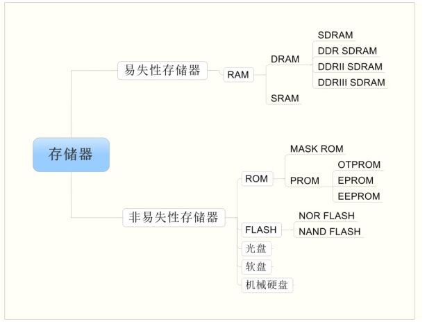
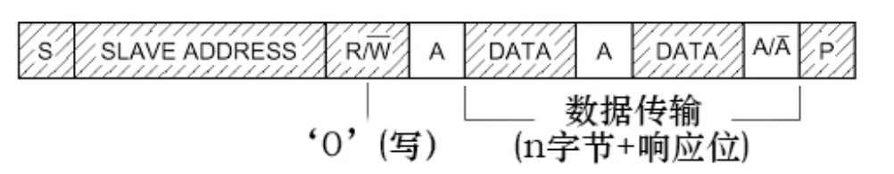
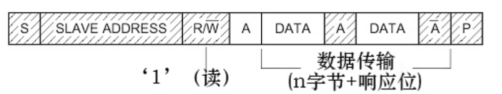
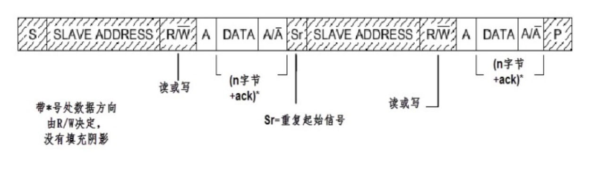
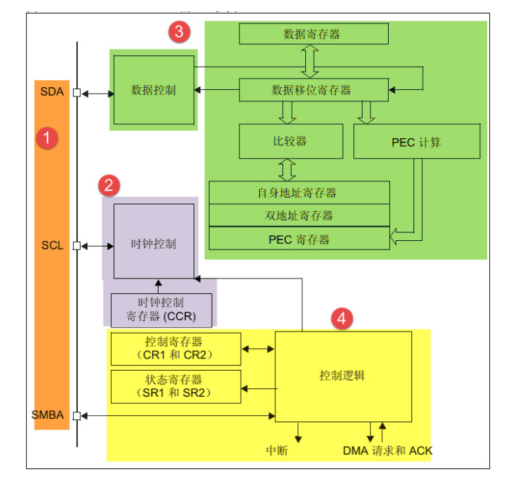
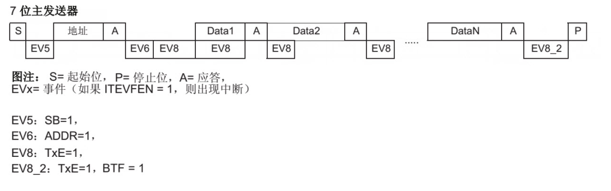
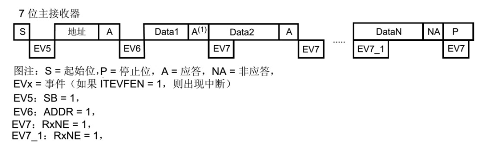
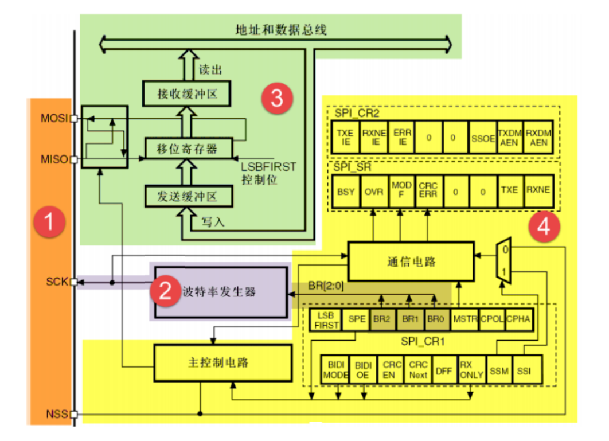
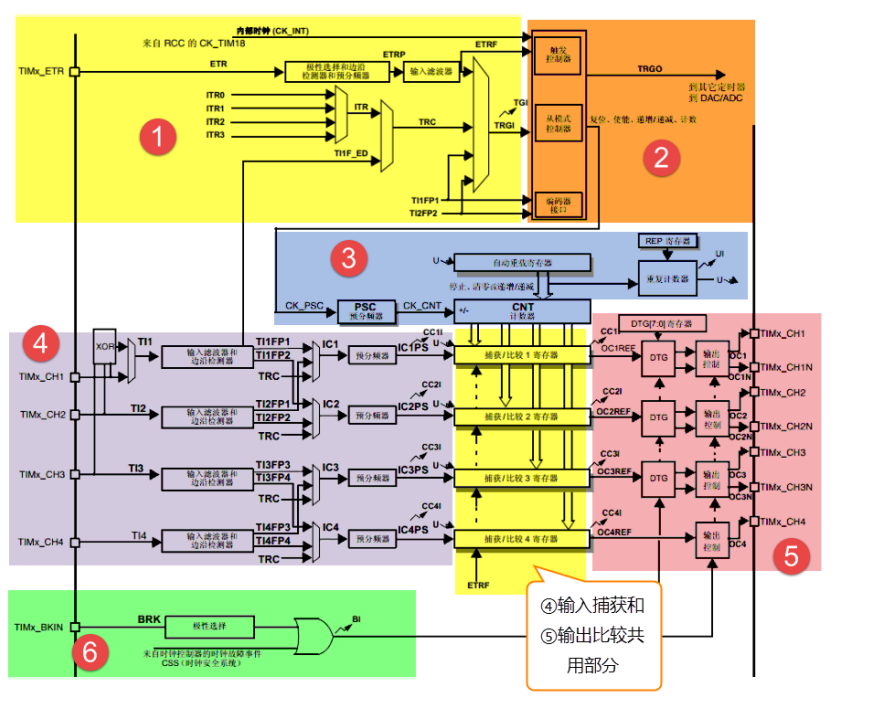

# HAL库

## 第 13 章 启动文件详解

### Stack -- 栈

```C
Stack_Size      EQU     0x00000400

                AREA    STACK, NOINIT, READWRITE, ALIGN = 3
Stack_Mem       SPACE   Stack_Size
__initial_sp
```

- 开辟栈的大小为0x00000400(1KB)，名字为 STACK， NOINIT即不被初始化，可读可写，8（2^3）字节对齐。
- 栈的作用是用于局部变量，函数调用，函数形参等得开销，栈的大小不能超过内部 SRAM 的大小。如果编写的程序比较大，定义的局部变量很多，那么就需要修改栈的大小。

**EQU** : 宏定义的伪指令，相当于等于，类似与 C 中的 define。

**AREA** ： 告诉汇编器汇编一个新的代码段或者数据段。STACK 表示段名，这个可以任意命名；NOINIT 表示不初始化；READWRITE 表示可读可写，ALIGN = 3，表示按照 2^3 对齐，即 8 个字节对齐。

**SPACE** ： 用于分配一定大小的内存空间，单位为字节。这里的指定大小等于Stack_Size。

**__initial_sp** : 表示栈的结束地址，即栈顶地址，栈是由高向低生长得。

### Heap -- 堆

```C
Heap_Size       EQU     0x00000200

                AREA    HEAP, NOINIT, READWRITE, ALIGN = 3
__heap_base
Heap_Mem        SPACE   Heap_Size
__heap_limit
```

- 开辟堆的大小为 0X00000200（512 字节），名字为 HEAP， NOINIT 即不初始化，可读可写， 8（2^3）字节对齐。 __heap_base 表示对的起始地址， __heap_limit 表示堆的结束地址。堆是由低向高生长的，跟栈的生长方向相反。
- 堆主要用来动态内存的分配，像 malloc() 函数申请的内存就在堆上面。这个在 STM32 里面用的比较少。

### 向量表

```C
AREA    RESET, DATA, READONLY
EXPORT  __Vectors
EXPORT  __Vectors_End
EXPORT  __Vectors_Size
```

- 定义一个数据段，名字为 RESET，可读。并声明 __Vectors、__Vectors_End 和 __Vectors_Size 这三个标号具有全局属性，可供外部的文件调用。

**EXPORT** : 声明一个标号可被外部文件使用，使标号具有全局属性。如果是 IAR 编译器，则使用的是 GLOBAL 指令。

- 当内核响应了一个发生的异常后，对应的异常服务器例程（ESR）就会执行。为了决定 ESR 的入口地址，内核响应使用了“向量表机制”。向量表其实是一个 WORD (32位整数)数组，每个下标对应一种异常，该下标元素的值则为 ESR 的入口地址。向量表在地址空间中的位置可以设置，通过 NVIC 中的一个重定位寄存器来指出向量表的地址。在复位后，该寄存器值为 0 。因此，在地址 0 （即FLASH地址0）处必须包好一张向量表，用于初始化时的异常分配。要注意的是：0号类型并不是什么入口地址，而是给出了复位后MSP的初值。

### 复位程序

```C
AREA        |.text|, CODE, READONLY     ;定义一个名称为.text的代码段，可读

Reset_Handler PROC
            EXPORT Reset_Handle     [WEAK]
            IMPORT SystemInit
            IMPORT __main


            LDR         R0, =SystemInit
            BLX         R0
            LDR         R0, =__main
            BX          R0
            ENDP
```

- 复位子程序是系统上电后第一个执行的程序，调用 SystemInit 函数初始化系统时钟，然后调用 C 库函数 __main， 最终调用 main 函数。

**WEAK** : 表示弱定义，如果外部文件优先定义了该标号则首先应用该标号，如果外部文件没有声明也不会出错。这里表示复位子程序可以由用户在其它文件重新实现，并不是唯一。

**IMPORT** ： 表示该标号来自外部文件，跟 C 语言中的 EXTERN 关键字类似。这里表示 SystemInit 和 __main 这两个函数均来自外部的文件。

- SystemInit() 是一个标准的库函数，在 system_stm32f103xe.c 这个库文件中定义。主要作用是配置系统时钟，这里调用这个函数之后，单片机的系统时钟被配置为 72M。
- __main 是一个标准的 C 语言库函数，主要作用是初始化用户的堆栈，并在函数的最后去调用 mian 函数。

| 指令名称 |                                                作用                                                |
| :------: | :------------------------------------------------------------------------------------------------: |
|   LDR   |                                   从存储器中加载字到一个寄存器中                                   |
|    BL    |                 跳转到由寄存器/标号给出的地址， 并把跳转前的下条指令地址保存到 LR                 |
|   BLX   | 跳转到由寄存器给出的地址，并根据寄存器的 LSE 确定处理器的状态，还要把跳转前的下条指令地址保存到 LR |
|    BX    |                              跳转到由寄存器/标号给出的地址，不用返回                              |

### 中断服务程序

- 在启动文件里面已经写好所有中断的中断服务函数（这些中断服务函数是空的），真正的中断服务程序需要我们在外部 C 文件里面重新实现。
- 如果我们在使用某个外设的时候，开启了某个中断，但是又忘记编写配套的中断服务程序或者函数名写错，那中断来临时，程序就会跳转到启动文件预先写好的空的中断服务程序中，并且在这个空函数中无线循环，及程序死在这里。

```C
NMI_Handle      PROC    ;系统异常
                EXPORT  NMI_Handle      [WEAK]
                B
                ENDP
;中间省略
SysTick_Handle  PROC
                EXPORT SysTick_Handle   [WEAK]
                B
                ENDP

Default_Handle  PROC    ;外部中断
                EXPORT  WWDG_IRQHandle  [WEAK]
                EXPORT  PVD_IRQHandle   [WEAK]
                EXPORT  TAMP_STAMP_IRQHandle    [WEAK]
;中间省略
LTDC_IRQHandle
LTDC_ER_IRQHandler
DMA2D_IRQHandler
                B
                ENDP
```

### 用户堆栈初始化

```C
; 用户栈和堆初始化， 由 C 库函数 __main 完成

    IF          :DEF:__MICROLIB     ;这个宏在 KELL 里面开启
    EXPORT      __initial_sp
    EXPORT      __heap_base
    EXPORT      __heap_limit


    ELSE

    IMPORT      __use_two_region_memory     ;由用户自己实现
    EXPORT      __user_initial_stackheap


__user_initial_stackheap

    LDR         R0, = Heap_Mem
    LDR         R1, = (Stack_Mem + Stack_Size)
    LDR         R2, = (Heap_Mem + Heap_Size)
    LDR         R3, = Stack_Mem
    BX          LR


    ALIGN

    ENDIF
    END
```

## 第 14 章 RCC  使用 HSI/HSE 配置系统时钟

**RCC** : reset clock control 复位时钟控制器。

### RCC 主要作用 -- 时钟部分

- 设置系统时钟 SYSCLK、设置 AHB 分频因子（决定 HCLK）、设置 APB2 分频因子（决定 PCLK2）、设置 APB1 分频因子（决定 PCLK1）、设置各个外设的分频因子；控制AHB、APB2 和 APB1 这三条总线时钟的开启、控制每个外设的时钟的开启。对于 SYSCLK、HCLK、PCLK2、PCLK1 这四个时钟的一般的配置是：PCLK2 = HCLK = SYSCLK = PLLCLK = 72M， PCLK1 = HCLK/2 = 36M。

### RCC框图


#### **系统时钟**

1. **HSE 高速外部时钟信号**

   - HSE 可以由有源晶振或者无源晶振提供，频率从 4-16MHZ 不等。当使用有源晶振时，时钟从 OSC_OUT 引脚进入， OSC_OUT 引脚悬空，当选用无源晶振时，时钟从 OSC_IN 和 OSC_OUT 进入，并且要配谐振电容。
   - HSE 最常用的就是 8M 的无源晶振。当确定 PLL 时钟来源时，HSE 可以不分频或者 2 分频，可以由时钟配置寄存器 CFGR 的位 17：PLLXTPRE 设置。
2. **PLL 时钟源**

   - PLL 时钟来源有两个，一个来自 HSE， 另一个是 HSI/2，具体有时钟配置寄存器 CFGR 的位 16：PLLSRC 设置。HSI 是内部高速时钟信号，频率位 8M，根据温度和环境的情况频率会有漂移，一般不作为 PLL 时钟来源。
   - PLL 时钟 PLLCLK 通过设置 PLL 的倍频因子，可以对 PLL 的时钟来源进行倍频，倍频因子可以是 :[2,3,4,5,6,7,8,9,10,11,12,13,14,15,16], 具体由时钟寄存器 CFGR的位 21-18：PLLMUL[3:0] 设置。
3. **系统时钟 SYSCLK**

   - 系统时钟来源可以是： HSI、PLLCLK、 HSE，具体由时钟寄存器 CFGR 的位1-0：SW[1:0]设置。
4. **AHB 总线时钟 HCLK**

   - 系统时钟 SYSCLK 经过 AHB 预分频器分频之后得到时钟叫 APB 总线时钟，即 HCLK，分频因子可以是 :[1,2,4,8,16,64,128,256,512]，具体的可以由时钟配置寄存器 CFGR的位 7-4:HPRE[3:0]设置。片上大部分外设的时钟都经过 HCLK 分频得到。
5. **APB2 总线时钟 HCLK2**

   - APB2 总线时钟 PCLK2由 HCLK 经过高速 APB2 预分频得到， 分频因子可以是 :[1,2,4,8,16],具体由时钟配置寄存器 CFGR 的位 13-11：PPRE2[2:0]决定。HCLK2属于高速的总线时钟，片上高速的外设就挂载到这条总线上，比如全部的 GPIO、USART1、SPI1 等。至于 APB2 总线上的外设的时钟设置为多少，得等到使用该外设时设置。
6. **APB1 总线时钟 HCLK1**

   - APB1 总线时钟 PCLK1 由 HCLK 经过低速 APB 预分频器得到， 分频因子可以是:[1,2,4,8,16]，具体的由时钟配置寄存器 CFGR 的位 10-8：PRRE1[2:0] 决定。 HCLK1 属于低速的总线时钟，最高为 36M，片上低速的外设挂载到这条总线是上，比如 USART2/3/4/5、SPI2/3、I2C1/2等。
7. **设置系统时钟库函数**

```C
/**
  * @brief  Sets System clock frequency to 72MHz and configure HCLK, PCLK2 
  *         and PCLK1 prescalers. 
  * @note   This function should be used only after reset.
  * @param  None
  * @retval None
  */
static void SetSysClockTo72(void)
{
  __IO uint32_t StartUpCounter = 0, HSEStatus = 0;
  
  /* SYSCLK, HCLK, PCLK2 and PCLK1 configuration ---------------------------*/  
  /* Enable HSE */  
  RCC->CR |= ((uint32_t)RCC_CR_HSEON);
 
  /* Wait till HSE is ready and if Time out is reached exit */
  do
  {
    HSEStatus = RCC->CR & RCC_CR_HSERDY;
    StartUpCounter++;  
  } while((HSEStatus == 0) && (StartUpCounter != HSE_STARTUP_TIMEOUT));

  if ((RCC->CR & RCC_CR_HSERDY) != RESET)
  {
    HSEStatus = (uint32_t)0x01;
  }
  else
  {
    HSEStatus = (uint32_t)0x00;
  }  

  if (HSEStatus == (uint32_t)0x01)
  {
    /* Enable Prefetch Buffer */
    FLASH->ACR |= FLASH_ACR_PRFTBE;

    /* Flash 2 wait state */
    FLASH->ACR &= (uint32_t)((uint32_t)~FLASH_ACR_LATENCY);
    FLASH->ACR |= (uint32_t)FLASH_ACR_LATENCY_2;  

 
    /* HCLK = SYSCLK */
    RCC->CFGR |= (uint32_t)RCC_CFGR_HPRE_DIV1;
    
    /* PCLK2 = HCLK */
    RCC->CFGR |= (uint32_t)RCC_CFGR_PPRE2_DIV1;
  
    /* PCLK1 = HCLK */
    RCC->CFGR |= (uint32_t)RCC_CFGR_PPRE1_DIV2;
```

```C
void Hal_Clock_Init(void)
{
#if  1
  //外部晶振时钟
  RCC_DeInit();/*把RCC外设初始化成复位状态 */
  RCC_HSEConfig( RCC_HSE_ON );/*使能HSE，开启外部晶振*/
  //HSEStartUpStatus = RCC_WaitForHSEStartUp();  /*等待 HSE 启动稳定*/

  /* 只有HSE稳定之后则继续往下执行*/
  //if ( HSEStartUpStatus == SUCCESS )/*检测HSE是否真的启动*/
  {
      FLASH_PrefetchBufferCmd( ENABLE );
      FLASH_PrefetchBufferCmd( FLASH_PrefetchBuffer_Enable ); /*使能FLASH预读取缓冲区 */
      FLASH_SetLatency( FLASH_Latency_2 );  /*SYSCLK周期与闪存访问时间的比例设置，这里统一设置成2*/
      RCC_PLLConfig( RCC_PLLSource_HSE_Div2, RCC_PLLMul_12 );   /* 8*6 M  = 48M主频*/
      RCC_PLLCmd( ENABLE );/*使能PLL*/
      RCC_SYSCLKConfig( RCC_SYSCLKSource_PLLCLK ); /*设置了SYSCLK的提供者为PLL*/
      RCC_HCLKConfig( RCC_SYSCLK_Div1 ); /*设置AHB分频器的分频系数 HCLK = SYSCLK=48M*/
      RCC_PCLK2Config( RCC_HCLK_Div1 );  /*设置APB2外设的时钟频率 PCLK2 = HCLK=48M--STM32串口波特率的确定*/
      RCC_PCLK1Config( RCC_HCLK_Div2 );  /*设置APB1外设的时钟频率 PCLK1 = HCLK/2=24M*/

      //RCC_SYSCLKConfig(RCC_SYSCLKSource_HSE); /*Select HSE as system clock source*/

      while ( RCC_GetFlagStatus( RCC_FLAG_PLLRDY ) == RESET );/*等待 PLL稳定*/

      while ( RCC_GetSYSCLKSource() != 0x08 );  /*读取时钟切换状态位，确保PLLCLK被选为系统时钟*/
  }

#else
    {
      //内部晶振时钟
      RCC_DeInit();
      RCC_HSICmd( ENABLE );
      FLASH_PrefetchBufferCmd( ENABLE );
      FLASH_SetLatency( FLASH_Latency_2 );
      RCC_PLLConfig( RCC_PLLSource_HSI_Div2, RCC_PLLMul_12 );   // 4*12M  = 48M主频
      RCC_SYSCLKConfig( RCC_SYSCLKSource_PLLCLK );
      RCC_PLLCmd( ENABLE );
      RCC_HCLKConfig( RCC_SYSCLK_Div1 );       /*AHB,AHB时钟= 系统时钟*/
      RCC_PCLK2Config( RCC_HCLK_Div1 );       /*设置高速AHB时钟（PCLK2）*/
      RCC_PCLK1Config( RCC_HCLK_Div2 );       /*设置低速AHB时钟（PCLK1）24M*/

      while ( RCC_GetFlagStatus( RCC_FLAG_PLLRDY ) == RESET );

      while ( RCC_GetSYSCLKSource() != 0x08 );          //锁相环稳定
    }
#endif  
}
```

## 第 15 章 中断应用概览

### 1.异常类型

- F103 在内核水平上搭载了一个异常响应系统，支持为数众多的系统异常和外部中断。其中系统异常有 8 个，外部中断有 60 个。除了个别异常的优先级被定死外，其他异常的优先级都是可编程的，有关具体的系统异常和外部中断可在 HAL 库文件 stm32f1xx.h 头文件查询，在 IRQn_Type 结构体中包含 F103 系列全部异常声明。
- 系统异常清单

| 编号 | 优先级 | 优先级类型 |     名称     |                         说明                         |           地址           |
| :--: | :----: | :--------: | :-----------: | :--------------------------------------------------: | :-----------------------: |
|     |   *   |     *     |       *       |             保留（实际存得是 MSP 地址）             |        0x0000 0000        |
|     |   -3   |    固定    |     Reset     |                         复位                         |        0x0000 0004        |
|     |   -2   |    固定    |      NMI      | 不可屏蔽中断。RCC 时钟安全系统（CSS）连接到 NMI 向量 |        0x0000 0008        |
|     |   -1   |    固定    |   HardFault   |                     所有类型错误                     |        0x0000 000C        |
|     |   0   |   可编程   |   MemManage   |                      存储器管理                      |        0x0000 0010        |
|     |   1   |   可编程   |   BusFault   |              存取指失败，存储器访问失败              |        0x0000 0014        |
|     |   2   |   可编程   |  UsageFault  |                未定义的指令或非法状态                |        0x0000 0018        |
|     |   *   |     *     |       *       |                         保留                         | 0x0000 001C - 0x0000 002B |
|     |   3   |   可编程   |    SVCall    |             通过 SWI 指令调用的系统服务             |        0x0000 002C        |
|     |   4   |   可编程   | Debug Monitor |                      调试监控器                      |        0x0000 0030        |
|     |   *   |     *     |       *       |                         保留                         |        0x0000 0034        |
|     |   5   |   可编程   |    PendSV    |                   可挂起的系统服务                   |        0x0000 0038        |
|     |   6   |   可编程   |    SysTick    |                                                     |        0x0000 003C        |

- F103 外部中断清单

| 编号 | 优先级 | 优先级类型 |  名称  |                说明                |    地址    |
| :--: | :----: | :--------: | :----: | :---------------------------------: | :---------: |
|  0  |   7   |   可编程   |  WWDG  |           窗口看门狗中断           | 0x0000 0040 |
|  1  |   8   |   可编程   |  PVD  | 连接 EXTI 的电源电压检测（PVD）中断 | 0x0000 0044 |
|  2  |   9   |   可编程   | TAMPER |            浸入检测中断            | 0x0000 0048 |
| ... |  ...  |    ...    |  ...  |                 ...                 |     ...     |

### 2.NVIC

- NVIC: 嵌套向量中断控制器，控制整个芯片中断相关的功能，跟内核紧密耦合，是内核里面的一个外设。但是各个芯片厂商在芯片设计时会对 Cortex-M3 内核里面的 NVIC 进行裁剪，把不需要的部分去掉，所以说 STM32 的 NVIC 是 Cortex-M3 的 NVIC 的一个子集。

```C
/** @addtogroup CMSIS_CM3_NVIC CMSIS CM3 NVIC
  memory mapped structure for Nested Vectored Interrupt Controller (NVIC)
  @{
 */
typedef struct
{
  __IO uint32_t ISER[8];                      /*!< Offset: 0x000  Interrupt Set Enable Register           */
       uint32_t RESERVED0[24];                                 
  __IO uint32_t ICER[8];                      /*!< Offset: 0x080  Interrupt Clear Enable Register         */
       uint32_t RSERVED1[24];                                  
  __IO uint32_t ISPR[8];                      /*!< Offset: 0x100  Interrupt Set Pending Register          */
       uint32_t RESERVED2[24];                                 
  __IO uint32_t ICPR[8];                      /*!< Offset: 0x180  Interrupt Clear Pending Register        */
       uint32_t RESERVED3[24];                                 
  __IO uint32_t IABR[8];                      /*!< Offset: 0x200  Interrupt Active bit Register           */
       uint32_t RESERVED4[56];                                 
  __IO uint8_t  IP[240];                      /*!< Offset: 0x300  Interrupt Priority Register (8Bit wide) */
       uint32_t RESERVED5[644];                                
  __O  uint32_t STIR;                         /*!< Offset: 0xE00  Software Trigger Interrupt Register     */
}  NVIC_Type;                                             
/*@}*/ /* end of group CMSIS_CM3_NVIC */
```

- 在配置中断的时候我们一般只用 ISER、ICER 和 IP 这三个寄存器， ISER 用来使能中断， ICER 用来失能中断， IP 用来设置中断优先级。

### 3. NVIC 中断配置固件库

- 固件库文件 core_cm3.h 的最后，还提供了 NVIC 的一些函数，这些函数遵循 CMSIS 规则，只要是 Cortex-M3 的处理器都可以使用。

|                         NVIC 库函数                         |       描述       |
| :---------------------------------------------------------: | :--------------: |
|             void NVIC_EnableIRQ(IRQn_Type IRQn)             |     使能中断     |
|            void NVIC_DisableIRQ(IRQn_Type IRQn)            |     失能中断     |
|           void NVIC_SetPendingIRQ(IRQn_Type IRQn)           |  设置中断悬起位  |
|          void NVIC_ClearPendingIRQ(IRQn_Type IRQn)          |  清除中断悬起位  |
|         uint32_t NVIC_GetPendingIRQ(IRQn_Type IRQn)         | 获取中断悬起编号 |
| void NVIC_SetPriorityIRQ(IRQn_Type IRQn, uint32_t priority) |  设置中断优先级  |
|        uint32_t NVIC_GetPriorityIRQ(IRQn_Type IRQn)        |  获取中断优先级  |
|                 void NVIC_SystemReset(void)                 |     系统复位     |

### 4. 优先级定义

- 在 NVIC 有一个专门的寄存器：中断优先级寄存器 NVIC_IPRx, 用来配置外部中断的优先级，IPR 宽度为 8bit，原则上每个外部中断可以配置的优先级为 0~255，数值越小，优先级越高。但是绝大多数 CM3 芯片都会精简设计，以致实际上的优先级数减少，在 F103 中，只使用了高 4bit。
- 用于表达优先级的这 4bit，又被分组成抢占优先级和子优先级。如果有多个中断同时响应，抢占优先级高的就会抢占抢占优先级低的优先得到执行，如果抢占优先级相同，就比较子优先级。如果抢占优先级和子优先级都相同的话，就比较他们硬件中断的编号，编号越小，优先级越高。

### 5.中断编程

- 在配置每个中断的时候一般有 3 个编程要点：
  1. 使能外设某个中断，这个具体由每个外设的相关中断使能位控制。比如串口有发送完成中断，接收完成中断。
  2. 配置 EXTI 中断源、配置中断优先级
  3. 编写中断服务函数：在启动文件 startup_stm32f103xe.s 中我们预先为每个中断都写好了一个中断服务函数，只是这些中断函数都是空的，为的只是初始化中断向量表。实际的中断服务函数需要我们重新编写，为了方便管理，把中断服务函数统一写在 stm32f1xx_it.c 这个库文件中。关于中断服务函数的函数名必须更启动文件里面预先设置的一样，如果写错，系统就在中断向量表中找不到中断服务函数的入口，直接跳转到启动文件里面预先写好的空函数，并且在里面无线循环，实现不了中断。

## 第 17 章 SysTick -- 系统定时器

### 1. 简介

- SysTick -- 系统定时器是属于 CM3 内核中的一个外设，内嵌在 NVIC 中，系统定时器是一个 24bit 向下递减的计数器，计数器每计数一次的时间为 1/SYSCLK，一般我们设置系统时钟 SYSCLK 等于 72M。当重装载数值寄存器递减到 0 的时候，系统定时器就产生一次中断，以此循环往复。
- 因为 SysTick 是属于 CM3 内核外设，所以所有基于 CM3 内核的单片机都具有这个系统定时器。系统定时器一般用于操作系统，用于产生时基，维持操作系统的心跳。

### 2. SysTick 寄存器介绍

- SysTick -- 系统定时器一般有 4 个寄存器，在使用 SysTick 产生定时的时候，只需要配置前三个寄存器，最后一个校准寄存器不需要使用。

| 寄存器名称 |        寄存器描述        |
| :--------: | :----------------------: |
|    CTRL    | SysTick 控制及状态寄存器 |
|    LOAD    | SysTick 重装载数值寄存器 |
|    VAL    |  systick 当前数值寄存器  |
|   CALIB   |  SysTick 校准数值寄存器  |

### 3. 配置库函数

- **配置库函数**

```C
__STATIC_INLINE uint32_t SysTick_Config(uint32_t ticks)
{
  //不可能得重装载值，超出范围
  if((ticks - 1UL) > SysTick_LOAD_RELOAD_Msk){
    return (1UL);
  }

  //设置重装载寄存器
  SysTick->LOAD = (uint32_t)(ticks - 1UL);

  //设置中断优先级
  NVIC_SetPriority(SysTick_IRQn, (1UL << __NCIV_PRIO_BITS) - 1UL);

  //设置当前数值寄存器
  SysTick->VAL = 0UL;

  //设置系统定时器的时钟源为 AHBCLK = 72M
  //使能系统定时器中断
  //使能定时器
  SysTick->CTRL = SysTick_CTRL_CLKSOURCE_Msk  |
                  SysTick_CTRL_TICKINT_Msk    |
                  SysTick_CTRL_ENANLE_Msk;
  
  return (0UL);
}
```

- 用固件库编程的时候我们只需要调用库函数 SysTick_Config() 即可，形参 ticks 用来设置重装载寄存器的值，最大不能超过重装载寄存器的值 2^24,当重装载寄存器的值递减到 0 的时候产生中断，然后重装载寄存器的值you重装载往下递减计数。紧随其后设置好中断优先级，最后配置系统定时器的时钟等于 AHBCLK = 72M,使能定时器和定时器中断。
- **配置 SysTick 中断优先级**

```C
/**
  * @brief  Configures the priority grouping: pre-emption priority and subpriority.
  * @param  NVIC_PriorityGroup: specifies the priority grouping bits length. 
  *   This parameter can be one of the following values:
  *     @arg NVIC_PriorityGroup_0: 0 bits for pre-emption priority
  *                                4 bits for subpriority
  *     @arg NVIC_PriorityGroup_1: 1 bits for pre-emption priority
  *                                3 bits for subpriority
  *     @arg NVIC_PriorityGroup_2: 2 bits for pre-emption priority
  *                                2 bits for subpriority
  *     @arg NVIC_PriorityGroup_3: 3 bits for pre-emption priority
  *                                1 bits for subpriority
  *     @arg NVIC_PriorityGroup_4: 4 bits for pre-emption priority
  *                                0 bits for subpriority
  * @retval None
  */
void NVIC_PriorityGroupConfig(uint32_t NVIC_PriorityGroup)
{
  /* Check the parameters */
  assert_param(IS_NVIC_PRIORITY_GROUP(NVIC_PriorityGroup));
  
  /* Set the PRIGROUP[10:8] bits according to NVIC_PriorityGroup value */
  SCB->AIRCR = AIRCR_VECTKEY_MASK | NVIC_PriorityGroup;
}
```

- **SysTick 初始化**

```C
/**
  * @brief  Initializes the NVIC peripheral according to the specified
  *         parameters in the NVIC_InitStruct.
  * @param  NVIC_InitStruct: pointer to a NVIC_InitTypeDef structure that contains
  *         the configuration information for the specified NVIC peripheral.
  * @retval None
  */
void NVIC_Init(NVIC_InitTypeDef* NVIC_InitStruct)
{
  uint32_t tmppriority = 0x00, tmppre = 0x00, tmpsub = 0x0F;
  
  /* Check the parameters */
  assert_param(IS_FUNCTIONAL_STATE(NVIC_InitStruct->NVIC_IRQChannelCmd));
  assert_param(IS_NVIC_PREEMPTION_PRIORITY(NVIC_InitStruct->NVIC_IRQChannelPreemptionPriority));  
  assert_param(IS_NVIC_SUB_PRIORITY(NVIC_InitStruct->NVIC_IRQChannelSubPriority));
  
  if (NVIC_InitStruct->NVIC_IRQChannelCmd != DISABLE)
  {
    /* Compute the Corresponding IRQ Priority --------------------------------*/  
    tmppriority = (0x700 - ((SCB->AIRCR) & (uint32_t)0x700))>> 0x08;
    tmppre = (0x4 - tmppriority);
    tmpsub = tmpsub >> tmppriority;

    tmppriority = (uint32_t)NVIC_InitStruct->NVIC_IRQChannelPreemptionPriority << tmppre;
    tmppriority |=  NVIC_InitStruct->NVIC_IRQChannelSubPriority & tmpsub;
    tmppriority = tmppriority << 0x04;
      
    NVIC->IP[NVIC_InitStruct->NVIC_IRQChannel] = tmppriority;
  
    /* Enable the Selected IRQ Channels --------------------------------------*/
    NVIC->ISER[NVIC_InitStruct->NVIC_IRQChannel >> 0x05] =
      (uint32_t)0x01 << (NVIC_InitStruct->NVIC_IRQChannel & (uint8_t)0x1F);
  }
  else
  {
    /* Disable the Selected IRQ Channels -------------------------------------*/
    NVIC->ICER[NVIC_InitStruct->NVIC_IRQChannel >> 0x05] =
      (uint32_t)0x01 << (NVIC_InitStruct->NVIC_IRQChannel & (uint8_t)0x1F);
  }
}
```

## 第 18、19、20 章 通讯----USART DMA

### **串行通讯与并行通讯**

- 按数据传送的放式，通讯可分为串行通讯与并行通讯，串行通讯是指设备之间通过少量数据信号线，GND 线以及控制信号线，按数据位形式一位一位地传输数据的通讯方式。并行通讯指多根数据线进行传输的通讯方式。

|    特性    | 串行通讯 | 并行通讯 |
| :--------: | :------: | :------: |
|  通讯距离  |   较远   |   较近   |
| 抗干扰能力 |   较强   |   较弱   |
|  传输速率  |   较慢   |   较高   |
|    成本    |   较低   |   较高   |

#### 全双工、半双工及单工通讯

- 根据数据通讯的方向，通讯又分为全双工、半双工及单工通讯，他们主要以信道的方向来区分。
- 通讯方式

| 通讯方式 |                                                                               |
| :------: | :----------------------------------------------------------------------------: |
|  全双工  |                    在同一时刻，两个设备之间可以同时收发数据                    |
|  半双工  |                 两个设备之间可以收发数据，但不能在同一时刻进行                 |
|   单工   | 在任何时刻都只能进行一个方向的通讯，即一个固定为发送设备，另一个固定为接收设备 |

#### 同步通讯与异步通讯

- 根据通讯的数据同步方式，又分为同步和异步两种，区别是在通讯过程中是否使用到时钟信号进行简单的区分。
  1. 在同步通讯中，收发设备双方会使用一根信号线表示时钟信号，在时钟信号的驱动下双方进行协调，同步数据。通讯双方会统一规定在时钟信号的上升沿或下降沿对数据线进行采样。
  2. 在异步通讯中，不适用时钟信号进行数据同步，他们直接在数据信号中穿插一些同步用的信号位，或者把主体数据进行打包，以数据帧的格式传输数据，通讯时需双方约定好数据的传输速率。

## USART 串口通讯

- 串口通讯（Serial Communication）是一种设备之间非常常用的串行通讯方式，因为它简单便捷，因此大部分设备都支持改通讯方式，电子工程师在调试设备时也经常使用改通讯方式调试信息。对于通讯协议，可以分为物理层与协议层。物理层主要规定通讯系统中具有机械、电子功能部分的特性，确保原始数据在物理媒体的传输。协议层主要规定通讯逻辑，统一收发双方的数据打包、解包标准。

### 1. 物理层

- 串口通讯的物理层主要有多种标准即变种，RS-232 标准主要规定了信号的用途、通讯接口以及信号的电平标准。

1. 根据通讯使用的电平标准不同，串口通讯可分为 TTL 标准及 RS-232 标准。
   | 通讯标准 | 电平标准（发送端） |
   | :------: | :----------------: |
   |  5V TTL  | 逻辑1：2.4V——5V |
   |         |  逻辑0：0——0.5V  |
   |  RS-232  | 逻辑1：-15V——-3V |
   |         | 逻辑0：+3V——+15V |
2. 在最初的应用中，RS-232串口标准常用于计算机、路由与调制调节器（MODEN，“猫”）之间的通讯，在这种通讯系统中，设备被分为数据终端设备 DTE（计算机、路由）和数据通讯设备 DCE（调制调节器）。

### 2. 协议层

- 串口通讯的数据包由发送设备通过自身的 TXD 接口传输到接收设备的 RXD 接口。在串口通讯的协议层中，规定了数据包的内容，它由启识位，主体数据、校验位以及停止位组成，通讯双方的数据包格式要约定一致才能正常收发数据。
  1. 波特率：码元的长度
  2. 通讯的起始和停止信号
  3. 有效数据
  4. 数据校验

## STM32 的 USART

- 通用同步异步收发器（Universal Synchronous Asynchronous Receiver and Transmittter）是一个串行通讯设备，可以灵活地与外部设备进行全双工数据交换。有别于 USART 还有一个 UART（Universal Asynchronous Receiver and Transmittter），它是在 USART 的基础上裁剪掉了同步通信功能，只有异步通信。
- 串行通信一般是以帧格式传输数据，即是一帧一帧的传输，每帧包含有起始信号、数据信息、停止信息，可能还有校验信息。USART 就是对这些传输参数有具体规定。
- USART 满足外部设备对工业标准 NRZ 异步串行数据格式的要求，并且使用了小数波特率发生器，可以提供多种波特率，使得它的应用更加广泛。USART 支持同步单向通信和半双工单线通信；还支持局域互联网络 LIN、智能卡（SmartCard）协议与 IrDA（红外线数据协会）SIR ENDEC 规范。
- USART 支持使用 DMA，可实现高速数据通信。

### 功能引脚

1. TX：发送数据输出引脚
2. RX：接收数据输入引脚
3. SW_RX：数据接收引脚，只用于单线和智能卡模式，属于内部引脚。
4. nRTS：请求以发送（Request To Send），n 表示低电平有效。如果使能 RTS 流控制，当 USART 接收器准备好接收新数据时会将 nRTS 变成低电平；当接受寄存器已满时， nRTS 将被设置为高电平。该引脚只适用于硬件流控制。
5. nCTS：清除以发送（Clear To Send），n 表示低电平有效。如果使能 CTS 流控制，发送器在发送下一帧数据之前会检测 nCTS 引脚，如果为低电平，表示可以发送数据，如果为高电平则在发送完当前数据帧之后停止发送。引脚只适用于硬件流控制。
6. SCLK：发送器时钟输出引脚，这个引脚仅适用于同步模式。

### 数据寄存器

- USART 数据寄存器（USART_DR）只有低 9 位有效，并且第 9 位数据是否有效取决于 USART 控制寄存器1（USART_CR1）的 M 位设置。
- USART_DR 包含了已发送的数据或者接收到的数据。USART_DR 实际包含了两个寄存器，一个专门用于发送的可写 TDR，一个专门用于接收的可读 RDR。当进行发送操作时，往 USART_DR 写入数据会自动存储在 TDR 内；当进行读取操作时，向 USART_DR 读取数据会自动提取 RDR 数据。
- TDR 和 RDR 都是介于系统总线和移位寄存器之间。串行通信是一个位一个位传输的，发送时把 TDR 内容转移到发送移位寄存器，然后把移位寄存器每一位发送出去，接收时把接收到的每一位顺序保存在接收移位寄存器内然后才转移到 RDR。

### 控制器

- USART 有专门控制发送的发送器、控制接收的接收器，还有唤醒单元、中断控制等。使用 USART 之前需要向 USART_CR1 寄存器的 UE 位置 1 使能 USART，UE 位用来开启供给串口的时钟。发送或接受数据字长可选 8 位或 9 位，由 USART_CR1 的 M 位控制。
- **发送器**

  - 当 USART_CR1 寄存器的发送使能位 TE 置 1 时，启动数据发送，发送移位寄存器的数据会在 TX 引脚输出，低位在前，高位在后。如果是同步模式 SCLK 也输出时钟信号。
  - 一个字符帧发送需要三个部分：起始位+数据帧+停止位。起始位是一个位周期的低电平，位周期就是每一位占用的时间；数据帧就是我们要发送的 8 位或 9 位数据，数据是从最低位开始传输的；停止位是一定时间周期的高电平。

| 名称 |                  描述                  |
| :--: | :------------------------------------: |
|  TE  |                发送使能                |
| TXE | 发送寄存器位空，发送单个字节的时候使用 |
|  TC  |  发送完成，发送多个字节数据的时候使用  |
| TXIE |            发送完成中断使用            |

- **接收器**
  - 如果将 USART_CR1 的寄存器的 RE 置 1，使能 USART 接收，使得接收器在 RX 线开始搜索起始位。在确定到起始位后就根据 RX 线电平状态把数据存放在接收移位寄存器内。接收完成后就把接收移位寄存器数据移到 RDR 内，并把 USART_SR 寄存器的 RXNE 置 1，同时如果 USART_CR2 寄存器 RXNEIE 置 1 的话可以产生中断。

|  名称  |       描述       |
| :----: | :--------------: |
|   RE   |     接收使能     |
|  RXNE  | 读数据寄存器非空 |
| RXNEIE | 发送完成中断使能 |

### 校验控制

- STM32F103 系列控制器 USART 支持奇偶校验。当使用校验位时，串口传输的长度将是 8 位的数据帧加上 1 位的校验位总共 9  位，此时 USART_CR1 寄存器的 M 位需要设置为 1，即 9 数据位。将 USART_CR1 寄存器的 PCE 位置 1 就可以启动奇偶校验控制，奇偶校验由硬件自动完成。启动了奇偶校验控制之后，在发送数据帧时会自动添加校验位，接收数据时自动验证校验位。接收数据时如果出现奇偶校验位验证失败，会见 USART_SR 寄存器的 PE 位置 1，并可以产生奇偶校验中断。
- 使能了奇偶校验控制后，每个字符帧的格式将变成：起始位+数据帧+校验位+停止位。

### 中断控制

- USART 有多个中断请求事件，

|                 中断事件                 | 事件标志 | 使能控制位 |
| :--------------------------------------: | :-------: | :--------: |
|            发送数据寄存器为空            |    TXE    |   TXEIE   |
|                 CTS 标志                 |    CTS    |   CTSIE   |
|                 发送完成                 |    TC    |    TCIE    |
|          准备好读取接收到的数据          |   RXNE   |   RXNEIE   |
|              检测到上溢错误              |    ORE    |   RXNEIE   |
|              检测到空闲线路              |   IDEL   |   IELEIE   |
|               奇偶校验错误               |    PE    |    PEIE    |
|                 断路标志                 |    LBD    |   LBDIE   |
| 多缓冲通信中的噪声标志、上溢错误和帧错误 | NF/ORE/FE |    EIE    |

## DMA

### DMA 简介

- DMA（Direct Memory Access）直接存储器存取，是单片机的一个外设，它的主要作用是用来搬数据，但是不占用 CPU。数据传输支持从外设到存储器或者存储器到存储器，这里的存储器可以是 SRAM 或者是 FLASH。DMA 控制器包含了 DMA1 和 DMA2，其中 DMA1 有 7 个通道，DMA2 有 5 个通道，通道可以理解成数据传输的一种管道。

### DAM 功能框图


- DMA 控制器独立于内核，属于一个单独的外设，结构比较简单。

#### 1. DMA 请求

- 如果外设想要通过 DMA 来传输数据，必须先给 DMA 控制器发送 DAM 请求，DMA 收到请求信号之后，控制器会给外设一个应答信号，当外设应答后且 DMA 控制器收到应答信号之后，就会启动 DMA 传输，知道传输完毕。
- 不同的 DMA 控制器的通道对应着不同的外设请求。

#### 2. 通道

- DAM 具有 12 个独立编程的通道，其中 DAM1 有 7 个通道， DAM2 有 5 个通道，每个通道对应不同外设的 DMA 请求。虽然每个通道可以接受多个外设请求，但是同一时间只能接受一个，不能同时接受多个。

#### 3. 仲裁器

- 当发生多个 DMA 通道请求时，就由仲裁器处理先后响应处理的顺序。仲裁器管理 DMA 通道请求分为两个阶段。第一阶段输入软件阶段，可以在 DMA_CCRx 寄存器中设置，等级：非常高、高、中和低四个优先级。第二阶段属于硬件阶段，如果两个或以上的 DAM 通道请求设置的优先级一样，则它们优先级取决于通道号，编号越低优先权越高。

### DMA 数据配置

- 使用 DMA 最核心就是配置要传输的数据，DMA 传输数据的方向有三个：

  1. 从外设到存储器
  2. 从存储器到外设
  3. 从存储器到存储器
- 具体的方向 DMA_CCR 位 4 -- DIR 配置：0 表示从外设到存储器，1 表示从存储器到外设。外设地址由 DAM_CPAR 配置，存储器地址由 DMA_CMAR 配置。

1. 外设到存储器

   - 以 ADC 采集为例。DMA 外设寄存器的地址对应的就是 ADC 数据寄存器的地址，DMA 存储器的地址就是我们自定义的变量（用来接收存储 AD 采集的数据）的地址。方向设置外设为原地址。
2. 存储器到外设

   - 以串口向电脑端发送数据为例。DMA 外设寄存器的地址对应的就是串口数据寄存器的地址，DMA 存储器的地址就是我们自定义的变量（相当于一个缓冲区，用来存储通过串口发送到电脑的数据）的地址。方向设置外设为目标地址。
3. 存储器到存储器

   - 以内部 FLASH 向内部 SRAM 复制数据为例。 DMA外设寄存器的地址对应的就是内部 FLASH（相当于外设） 的地址，DMA 存储器的地址就是我们自定义的变量（相当于一个缓冲区，用来存储来自内部 FLASH 的数据）的地址。方向设置外设（内部 FALSH）为源地址。

## 第 21 章 常用存储器

### 1. 存储器种类

- 存储器是计算机结构的重要组成部分。存储器是用来存储程序代码和数据的部件，有了存储器计算机才具有记忆功能。



- 存储器按其存储介质特性主要分为 “易失性存储器” 和 “非易失性存储器”两大类。其中的“易失/非易失”是指存储器断电后，它存储的数据内容是否会丢失的特性。由于一般易失性存储器存取速度快，而非易失性存储器可长期保存数据，他们都在计算机中占据着重要角色。在计算机中易失性存储器最典型的代表是内存。

### 2. RAM

- RAM 是 “Random Access Memory” 的缩写，被一位随机存储器。随机存储指的是当存储器中的消息被读取或写入时，所需要的时间与这段信息在的位置无关。RAM 可随读取其内部任意地址的数据，时间都是相同的。
- 根据 RAM 的存储机制，又分为动态随机存储器 DRAM（Dynamic RAM）以及静态随机存储器 SRAM（Static RAM）两种。

#### DRAM

- 动态随机存储器 DRAM 的存储单元以电容的电荷表示数据，有电荷代表 1，无电荷代表 0。但时间一长，代表 1 的电容会放电，代表 0 的电容会吸收电荷，因此它需要定期刷新操作，这就是 “动态” 一词所形容的特性。刷新操作会对电容进行检查，若电量大于满电量的 1/2，则认为其代表 1，并把电容充满电；若电量小于 1/2，则认为代表 0，并把电容放电，藉此来保证数据的正确性。
- **SDRAM**：根据 DRAM 的通讯方式，又分为同步和异步两种，这两种方式根据通讯时是否需要使用时钟信号区分。由于使用时钟同步的通讯速度更快，所以同步 DRAM 使用更为广泛，这种 DRAM 被称为 SDRAM（Synchronous DRAM）。
- **DDR SDRAM**：为了进一步提高 SDRAM 的通讯速度，设计了 DDR SDRAM 存储器（Double Data Rate SDRAM）。它的存储特性与 SDRAM 没有区别，但 SDRAM 只在上升沿表示有效数据，在一个时钟周期内，只能表示 1 个有效数据；而 DDR SDRAM 在时钟的上升沿表示一个数据，也就是说在 1 个时钟周期内可以表示 2 位数据，在时钟频率同样的情况下，提高了一倍的速度。至于 DDRII 和 DDRIII，它们的通讯方式并没有区别，主要是通讯同步时钟的频率提高了。

#### SRAM

- 静态随机存储器 SRAM 的存储单元以锁存器来存储数据，这种电路结构不需要定时刷新充电，就能保持状态。同样地，SRAM 根据其通讯方式也分为同步（SSRAM）和异步 SRAM。

#### DRAM 和 SRAM 的应用场合

- 对比 DRAM 和 SRAM 的结构，可知 DRAM 的结构简单得多，所以产生相同容量的存储器，DRAM 的成本要更低，且集成度更高。而 DRAM 中的电容结构则决定了它的存取速度不如 SRAM。

|     特性     | DRAM | SRAM |
| :----------: | :--: | :--: |
|   存取速度   | 较慢 | 较快 |
|    集成度    | 较高 | 较低 |
|   生产成本   | 较低 | 较高 |
| 是否需要刷新 |  是  |  否  |

- 在实际应用场景中，SRAM 一般只用于 CPU 内部的高速缓存（Cache），而外部拓展的内存一般使用 DRAM。在 STM32 系统的控制器中，只有 STM32F429 型号或更高级的芯片才支持扩展 SDRAM，

### 非易失性存储器

- 非易失性存储器，半导体类的由 ROM 和 FLASH。

### 3. ROM 存储器

- ROM（Read Only Memory）只读存储器。由于技术发展，后来设计出了可以方便写入数据的 ROM，而这个 “Read Only Memory” 的名称被沿用，现代指非易失性半导体存储器。

### 4. FLASH 存储器

- FLASH 存储器又称为闪存，它也是可重复擦写的存储器。根据存取单元电路的不同，FALSH 存储器又分为 NOR FLASH 和 NAND FLASH。

|       特性       |     NOR FLASH     |       NAND FLASH       |
| :--------------: | :---------------: | :--------------------: |
| 同容量存储器成本 |       较贵       |         较便宜         |
|      集成度      |       较低       |          较高          |
|     介质类型     |     随机存取     |        连续存储        |
|  地址线和数据线  |     独立分开     |          共用          |
|     擦除单元     | 以“扇区/块”擦除 |   以“扇区/块”擦除   |
|     读写单元     | 可以基于字节读写 | 必须以“块”为单位读写 |
|     读取速度     |       较高       |          较低          |
|     写入速度     |       较低       |          较高          |
|       坏块       |       较少       |          较高          |
|   是否支持 XIP   |       支持       |         不支持         |

- NOR 与 NAND 的共性是在数据写入前都需要有擦除操作，而擦除操作一般是以 “扇区/块” 为单位的。而 NOR 与 NAND 特性的差别，主要是由于其内部 “地址/数据线” 是否分开导致的。
- 由于 NOR 的地址线和数据线分开，它可以按 “字节” 写数据，符合 CPU 指令译码执行要求，所以假如 NOR 上存储了代码指令，CPU 给 NOR 一个地址，NOR 就能向 CPU 返回一个数据让 CPU 执行，中间不需要额外的处理操作。
- 而由于 NAND 的数据和地址线共用，只能按“块”来读写数据，假如 NAND 上存储了代码指令，CPU 给 NAND 地址后，它无法直接返回该地址的数据，所以不符合指令译码要求。
- 若代码存储在 NAND 上，可以先把它加载到 RAM 存储器上，再由 CPU 执行。所以在功能上可以认为 NOR 是一种断电后数据不丢失的 RAM，但它的擦除单位与 RAM 有区别，且读写速度比 RAM 要慢得多。
- 另外，FALSH 的擦除次数都是有限的（现在普遍是 10 万次左右），当它的使用接近寿命的时候，可能会出现写操作失败。由于 NAND 通常是整块擦写，块内有一个失效整个块就会失效，这被称为坏块，而且由于擦写过程复杂，从整体来说 NOR 块更少，寿命更长。由于存在坏块，所以 FLASH 存储器需要 “探测/错误更正（EDC/ECC）”算法来确保数据的正确性。
- 由于两种 FLASH 存储器特性的差异， NOR FLASH 一般用于在代码存储的场合，如嵌入式控制器内部的程序存储空间。而 NAND FLASH 一般用在大数据量存储的场合，包括 SD 卡，U 盘以及固态硬盘等，都是 NAND FLASH 类型的。

## 第 22 章 I2C--读写 EEPROM

### 1. I2C

- I2C 通讯协议（Inter - Intergrated Circuit）是由 Phiilps 公司开发的，由于它引脚少，硬件实现简单，可拓展性强，不需要 USART、CAN 等通讯协议的外部收发设备，现在被广泛地使用在系统内多个集成电路（IC）间的通讯。
- 在计算机科学里，大部分复杂的问题都可以通过分层来简化。如芯片分为内核层和片上外设；STM32HAL 库则是在存储器与用户代码之间的软件层。对于通讯协议，也以分层的方式来理解，最基本的是把它分为物理层和协议层。物理层规定通讯系统中具有机械、电子功能部分的特性，确保原始数据在物理媒体的传输。协议层主要规定通讯逻辑，统一收发双方的数据打包、解包标准。

#### I2C 物理层


- 它的特点如下：
  1. 是一个支持设备的总线。“总线”指多个设备共用的信号线。在一个 I2C 通讯总线中，可连接多个 I2C 通讯设备，支持多个通讯主机及多个通讯从机。
  2. 一个 I2C 总线只适用两条总线线路，一条双向串行数据线（SDA），一条串行时钟线（SCL）。数据线即用来表示数据，时钟线用于数据收发同步。
  3. 每个连接到总线的设备都有一个独立的地址，主机可以利用这个地址进行不同设备之间的访问
  4. 总线通过上拉电阻接到电源。当 I2C 设备空闲时，会输出高组态，而当所有设备都空闲，都输出高阻态时，由上拉电阻把总线拉成高电平。
  5. 多个主机同时使用总线时，为了防止数据冲突，会利用仲裁方式决定由那个设备占用总线。
  6. 具有三种传输模式：标准模式传输速率为 100Kbit/s，快速模式为 400Kbit/s，高速模式下可达到 3.4Mbit/s。
  7. 连接到相同总线的 IC 数量受到总线最大电容 400pF 限制。

#### I2C 协议层







- 其中 S 表示由主机的 I2C 接口产生的*传输起始信号(S)*，这时连接到 I2C 总线上的所有从机都会受到这个信号。
- 起始信号产生后，所有从机就开始等待主机紧接下来广播的*从机地址信号（SLAVE_ADDRESS）*。在 I2C 总线上，每个设备的地址都是唯一的，当主机广播的地址与某个设备地址相同时，这个设备就被选中了，没被选中的设备将会忽略之后的数据信号。根据 I2C 协议，这个从机地址可以是 7 位或 10 位。
- 在地址之后，传输方向选择位，0：表示由主机传输至从机（写数据），1则是读数据。
- 从机接收到匹配的地址后，主机或从机会返回一个应答（ACK）或非应答（NACK）信号，只有接收到应答信号后，主机才能继续发送或接收数据。

1. 写数据
2. 读数据
3. 读和写数据（复合）：除了基本的读写，I2C 通讯更常用的是复合格式，即第三幅图的情况，该传输过程有两次起始信号（S）。一般在第一次传输中，主机通过 SLAVE_ADDRESS 寻找到从设备后，发送一段*数据*，这段数据通常用于表示从设备内部的寄存器或存储器地址（注意区分它与 SLAVE_ADDRESS 的区别）；在第二次传输中，对改地址的内容进行读或写。也就是说，第一次通讯是告诉从机读写地址，第二次则是读写的实际内容。
   1. 通讯的起始和停止信号
   2. 数据有效性
   3. 地址及数据方向
   4. 响应

### 2. STM32 的 I2C 特性及架构

- 如果我们直接控制 STM32 的两个 GPIO 引脚，分别用作 SCL 及 SDA，按照上述信号的时序要求，直接像控制 LED 灯那样控制引脚输出（若接收引脚则读取 SDA 电平），就可以实现 I2C 通讯。同样，假如我们按照 USART 的要求去控制引脚，也能实现 USART 通讯。
- 由于直接控制 GPIO 引脚电平产生通讯时序时，需要由 CPU 控制每个时刻的引脚状态，所以称之为 “软件模拟协议” 方式。
- 相对地，STM32 的 I2C 片上外设专门负责实现 I2C 通讯协议，只要配置好该外设，它就会自动根据协议产生通讯信号，收发数据并缓存起来，CPU 只要检测该外设的状态和访问数据寄存器，就能完成数据收发。
- STM32 的 I2C 外设可用作通讯的主机及从机，支持 100Kbit/s 和 400Kbit/s 的速率，支持 7 位、10 位设备地址，支持 DMA 数据传输，并具有数据校验功能。它的 I2C 外设还支持 SMBus2.0 协议。



1. 通讯引脚

   - I2C 的所有硬件架构都是 SCL 线和 SDA 线展开（其中的 SMBA 线用于 SMBUS 的告警信号，I2C 通讯没有使用）。STM32 芯片有多个 I2C 外设，它们的 I2C 通讯信号引出到不同的 GPIO 引脚上，使用时必须配置到这些指定的引脚。
2. 时钟控制逻辑

   - SCL 线的时钟信号，有 I2C 接口根据 *时钟控制寄存器(CCR)* 控制，控制的参数主要为时钟频率。配置 I2C 的 CCR 寄存器可修改通讯速率相关的参数：
   - 可选择 I2C 通讯的 “标准/快速” 模式，这两个模式对应速率
   - 在快速模式下的选择 SLC 时钟的占空比
   - SCL 信号线的输出时钟
3. 数据控制逻辑

   - I2C 的 SDA 信号主要连接到数据移位寄存器上，数据移位寄存器的数据来源及目标是数据寄存器（DR）、地址寄存器（OAR）、PEC 寄存器以及 SDA 数据线。当向外发送数据的时候，数据移位寄存器以 “数据寄存器” 为数据源，把数据一位一位地通过 SDA 信号线发送出去；当从外部接收数据的时候，数据一位寄存器把 SDA 信号线采样到的数据一位一位地存储到 “数据寄存器” 中。若使能了数据校验，接收到的数据会经过 PCE 计数器运算，运算结果存储在 “PEC寄存器” 中。当 STM32 的 I2C 工作在从机模式的时候，接收到设备地址信号时，数据移位寄存器会把接收到的地址与 STM32 的自身的 “I2C 地址寄存器” 的值作比较，以便响应主机的寻址。STM32 的自身 I2C 地址可通过修改 “自身地址寄存器”，支持同时使用两个 I2C 设备地址，两个地址分别存储在 OAR1 和 OAR2 中。
4. 整体控制逻辑

   - 整体控制逻辑负责协调整个 i2C 外设，控制逻辑的工作模式根据我们配置的 “控制寄存器（CR1/CR2）” 的参数而改变。在外设工作时，控制逻辑会根据外设的工作状态修改 “状态寄存器（SR1/SR2）”，我们只要读取这些寄存器相关的寄存器位，就可以了解 I2C 的工作状态。除此之外，控制逻辑还根据要求，负责控制产生 I2C 中断信号、DMA 请求及各种 I2C 的通讯信号（起始、停止、响应信号等）。

### 3. 通讯过程



- 主发送器发送流程及事件说明：
  1. 控制产生起始信号（S），当发生起始信号后，产生事件 “EV5”，并会对 SR1 寄存器的 “SB” 位置 1，表示起始信号已经发送
  2. 紧接着发送设备地址并等待应答信号，若有从机应答，则产生事件 “EV6” 及 “EV8”，这时 SR1 寄存器的 “ADDR” 位及 “TXE” 位被置 1，ADDR 为 1 表示地址已经发送，TXE 为 1 表示数据寄存器为空
  3. 以上执行并对 ADDR 位清零后，往 I2C 的 “数据寄存器DR” 写入要发送的数据，这时 TXE 位会被重置 0，表示数据寄存器非空，I2C 外设通过 SDA 信号线一位位把数据发送出去，又会产生 “EV8” 事件，即 TXE 位被置 1，重复这个过程，就发送多个字节数据
  4. 数据发送完成后，控制 I2C 设备产生一个停止信号（P），这个时候会产生 EV8_2 事件， SR1 的 TXE 位及 BTF 位 都被置 1，表示通讯结束



- 主接收器接收流程及事件说明如下：
  1. 同主发送流程，起始信号(S)是由主机端产生的，控制发生起始信号后，它产生事件“EV5”, 并会对 SR1 寄存器的“SB”位置1，表示起始信号已经发送；
  2. 紧接着发送设备地址并等待应答信号，若有从机应答，则产生事件“EV6”这时 SR1 寄存器的“ADDR”位被置1，表示地址已经发送。
  3. 从机端接收到地址后，开始向主机端发送数据。当主机接收到这些数据后，会产生“EV7”事 件，SR1 寄存器的 RXNE 被置 1，表示接收数据寄存器非空，我们读取该寄存器后，可对数据寄存器清空，以便接收下一次数据。此时我们可以控制I2C 发送应答信号(ACK) 或非应答信号(NACK)，若应答，则重复以上步骤接收数据，若非应答，则停止传输
  4. 发送非应答信号后，产生停止信号(P)，结束传输。在发送和接收过程中，有的事件不只是标志了我们上面提到的状态位，还可能同时标志主机状态之类的状态位，而且读了之后还需要清除标志位，比较复杂。我们可使用 STM32HAL 库函数来直接检测这些事件的复合标志，降低编程难度。

## 第 23 章 SPI

### 1. SPI 协议简介

- SPI 协议是由摩托拉公司提出的通讯协议（Serial Peripheral Interface），即串行外围设备接口，是一种高速全双工的通信总线。它被广泛地使用在 ADC、LCD 等设备与 MCU 间，要求通讯速率较高的场合。

1. 物理层

   - SPI 通讯使用 3 条总线及片选线，3 条总线分别为 SCK、MOSI、MISO

   1. （Slave Select）：从设备选择信号线，常称为片选信号线，也称为 NSS、CS。当有多个 SPI 从设备与 SPI 主机相连时，设备的其他信号线 SCK、MOSI 及 MISO 同时并联到相同的 SPI 总线上。I2C 协议中通过设备地址来寻址、选中总线上的某个设备并与其进行通讯；而 SPI 协议没有设备地址，他使用 NSS 信号线来寻址。
   2. SCK（Serial Clock）：时钟信号线，用于通讯数据同步。它由通讯主机产生，决定了通讯的速率，不同的设备支持的最高时钟频率不一样。
   3. MOSI（Master Output，Slave Input）:主设备输出/从设备输入引脚。主机的数据从这条信号线输出，从机由这条信号线读入主机发送的数据，即这条线上数据的方向为主机到从机。
   4. MISO（Master Input，Slave Output）：主设备输入/从设备输出引脚。主机从这条信号线读入数据，从机的数据有这条数据线输出到主机，即在这条线上数据的方向为从机到主机。
2. 协议层

   - 与 I2C 类似，SPI 协议定义了通讯的起始和停止信号、数据有效性、时钟同步等环节。NSS、SCK、MOSI 信号都有主机控制产生，而 MISO 的信号由从机产生，主机通过该信号线读取从机的数据。MOSI 与 MISO 的信号只在 NSS 为低电平的时候才有效，在 SCK 的每个时钟周期 MOSI 和 MISO 传输一位数据。

   1. 通讯的起始和停止信号
   2. 数据有效性
   3. CPOL/CPHA 及通讯模式

### 2. STM32 的 SPI

- STM32 的 SPI 外设可用作通讯的主机及从机，支持最高的 SCK 的时钟频率 fplck/2，完全支持 SPI 协议的 4 中模式，数据帧长度可设置为 8 位或 16 位，可设置数据 MSB 先行或 LSB 先行。它还支持双线全双工、双线单向及单线模式。其中双线单向模式可以同时使用 MOSI 及 MISO 数据线向一个方向传输数据，可以加快一倍的传输速度。而单线模式则可以减少硬件接线，当然这样速率会受到影响。



- 架构

  1. 通讯引脚
  2. 时钟控制逻辑
  3. 数据控制逻辑
  4. 整体控制逻辑
- 通讯过程：、

  - STM32 使用 SPI 外设通讯时，在通讯的不同阶段它会对 “状态寄存器 SR” 的不同数据位写入参数，我们通过读取这些寄存器标志来了解通讯状态。
  - 主模式收发流程及事件：

    1. 控制 NSS 信号线，产生起始信号
    2. 把要发送的数据写入到 “数据寄存器 DR”中，该数据会被存储到发送缓冲区
    3. 通讯开始，SCK 时钟开始运行。MOSI 把发送缓冲区中的数据一位一位地传输出去；MISO则把数据一位一位地存储进接收缓冲区
    4. 当发送完一帧数据的时候，“状态寄存器 SR”中的“TXE 标志位”会被置 1，表示传输完一帧，发送缓冲区已空；类似的，放接收完一帧数据的时候，“RXNE 标志位”会被置 1，表示传输完一帧，接收缓冲区非空
    5. 等待“TXE 标志位”为 1 时，若还要继续发送数据，则再次往“数据寄存器 DR”写入数据即可；等待到“RXNE 标志位”为 1 时，通过读取“数据寄存器 DR”可以获取接收缓冲区中的内容。假如我们使能了TXE或RXNE中断，TXE 或 RXNE 置1时会产生 SPI 中断信号，进入同一个中断服务函数，到 SPI 中断服务函数程序后，可通过检查寄存器位了解触发事件，再分别进行处理。也可使用 DMA 方式来收发“数据寄存器 DR”中的数据。

### 3. SPI 初始化结构体

```C
typedef struct
{
  uint16_t SPI_Direction;           /* 设置 SPI 的单双向模式 */

  uint16_t SPI_Mode;                /* 设置 SPI 的主/从机端模式 */

  uint16_t SPI_DataSize;            /* 设置 SPI 的数据长度，可选 8/16 位 */

  uint16_t SPI_CPOL;                /* 设置时钟极性 CPOL，可选高/低电平 */

  uint16_t SPI_CPHA;                /* 设置时钟相位，可选奇/偶边沿采样 */

  uint16_t SPI_NSS;                 /* 设置 NSS 引脚由 SPI 硬件控制还是软件控制 */
 
  uint16_t SPI_BaudRatePrescaler;   /* 设置时钟分频因子，fpclk/分频数 = fSCK */

  uint16_t SPI_FirstBit;            /* 设置 MSB/LSB 先行 */

  uint16_t SPI_CRCPolynomial;       /* 设置 CRC 效验表达式 */

  uint16_t SPI_TIMode;              /* 指定是否启用 TI 模式 */

  uint16_t SPI_CRCCalculation;      /* 指定是否启用 CRC 计算 */
}SPI_InitTypeDef;

```

- SPI--读写串行 FLASH 实验

## 第 28 章 ADC--电压采集

- STM32F103 有3个ADC，精度为12位，每个ADC最多有16个外部通道。其中ADC1和ADC2都有16个外部通道，ADC3根据CPU引脚的不同通道数也不同，一般都有8个外部通道。

### 功能

1. 电压输入范围
   - ADC输入范围为：V_REF- <= V_IN <= V_REF+。由V_REF-、V_REF+、V_DDA、V_SSA,这四个外部引脚决定。

2. 输入通道
   - STM32的ADC多达18个通道，其中外部的16个通道是ADCx_IN0、ADCx_IN1、...、ADCx_IN5。这16个通道对用不同的IO口。其中ADC1/2/3还有内部通道：ADC1的通道16连接到了芯片内部的温度传感器，Vrefint连接到了通道17。ADC2的模拟通道16和17连接到了内部的VSS。ADC3的模拟通道9、14、15、16和17连接到内部的VSS。
   - 规则通道：一般使用该通道
   - 注入通道：也就是插入，插队的意思。是一种在规则通道转换的时候强行插入要转换的一种。如果在规则通道的转换过程中，有注入通道插队，那么就要先转换完注入通道，等注入通道转换完成后，再回到规则通道的转换流程。

3. 转换顺序
   - 规则序列
   - 注入序列

4. 触发源
   - 通道选好了，转换的顺序也设置好了，接下来就是转换。ADC转换可以由ADC控制寄存器2：ADC_CR2的ADON这个位来控制，写1的时候开始转换，写0的时候停止转换。除此ADC还支持触发转换，这个触发包括内部定时器触发和外部定时器触发和外部IO触发。

5. 转换时间
   - ADC时钟：ADC输入时钟ADC_CLK由PCLK2经过分频产生，最大是14M，分频因子由RCC时钟配置寄存器RCC_CFGR的位15：14ADCPRE[1:0]设置，可以是2/4/6/8分频。
   - 采样时间：
   - 数据寄存器：

6. 中断
   - 转换结束中断：数据转换结束后，可以产生中断，中断分为三种：规则通道转换结束中断，注入转换通道转换结束中断，模拟看门狗中断。除了中断外，还可以产生DMA请求，把转换好的数据直接存储在内存里面。

7. 电压转换
   - 模拟电压经过ADC转换后，是一个12位的数字值，如果通过串口以16进制打印出来的话，可读性比较差，那么有时候我们就需要把数字电压转换成模拟电压，也可与实际的模拟电压对比。

### ADC_InitTypeDef结构体

1. 结构体
2. 软件设计
   1. 初始ADC用到的GPIO
   2. 设置ADC的工作参数并初始化
   3. 设置ADC工作时钟
   4. 设置ADC转换通道顺序及采样时间
   5. 配置使能ADC转换完成中断，在中断内读取转换完数据
   6. 是能ADC
   7. 使能软件触发ADC转换

## 第 29 章 定时器分类

- STM32F1中，除了互联型的产品，共有8个定时器，分为基本定时器，通用定时器和高级定时器。除了定时器TIM6和TIM7是一个16位向上技术的定时器，只能定时没有外部I/O。通用定时器TIM2/3/4/5是一个16位的可以向上/下计数的定时器，可以定时，可以输出比较，可以输出比较，可以输入捕捉，每个定时器有四个外部I/O。高级定时器TIM1/8是一个16位的可以向上/下计数的定时器，可以定时，可以输出比较，可以输入捕捉，还可以有三相电机互补输出信号，每个定时器有8个外部I/O。

||定时器|计数器分辨率|计数器类型|预分频系数|产生DMA|捕获/比较通道|互补输出|
|:--:|:--:|:--:|:--:|:--:|:--:|:--:|:--:|
|高级定时器|TIM1|16位|向上/下|1-65535|可以|4|有|
||TIM8|16位|向上/下|1-65535|可以|4|有|
|通用定时器|TIM2|16位|向上/下|1-65535|可以|4|没有|
||TIM3|16位|向上/下|1-65535|可以|4|没有|
||TIM4|16位|向上/下|1-65535|可以|4|没有|
||TIM5|16位|向上/下|1-65535|可以|4|没有|
|基本定时器|TIM6|16位|向上|1-65535|可以|0|没有|
||TIM7|16位|向上|1-65535|可以|0|没有|

### 基本定时器功能

- 基本定时器的核心是时基。


1. 时钟源：定时器时钟TIMxCLK，即内部时钟CK_INT，经APB1预分频器后分频提供，如果APB1预分频系数等于1，则频率不变，否则频率乘以2，库函数中APB1预分频的系数是2，即PCLK1 = 36M，所以定时器时钟TIMxCLK = 36*2=72M
2. 计数器时钟：定时器时钟经过PSC预分频器之后，即计数器时钟CK_CNT，用来驱动计数器计数。PSC是一个16位的预分频器，可以对定时器时钟TIMxCLK进行1-65535之间的任何一个数进行分频，具体计算方式位 CK_CNT = TIMxCLK / （PSC+1）
3. 计数器：计数器CNT是一个16位的计数器，只能往上计数，最大值为65535.当计数达到自动重载寄存器的时候产生更新时间，并清零从头开始计数
4. 自动重装载寄存器：ARR是一个16位寄存器，这里面装着计数器能计数的最大数值，当计数达到这个值时，如果使能了中断，定时器就会产生溢出中断
5. 定时时间计算：定时器的定时时间等于计数器的中断周期乘以中断的次数。计数器在CK_CNT的驱动下，计一个数的时间则是CK_CNT的倒数，1/（TIMxCLK/（PSC+1）），产生一次中断的时间等于：（（1/CK_CNT）*（ARR+1））*/。如果在中断服务程序里面设置一个变量time，用来记录中断的次数，那么就可以计算出我们需要的定时时间（1/CK_CNT）*（ARR+1）*time

### 定时器初始化结构体

- 在HAL库头文件stm32f1xx_hal_tim.h中对定时器外设建立了四个初始化结构体，基本定时器只用到其中一个即TIM_TimeBaseInitTypeDef，

```C
//------------定时器基本初始化结构体----------------------
typedef struct{
  uint32_t Prescaler;             //预分频器
  uint32_t CounterMode;           //计数模式
  uint32_t Period;                //定时器周期
  uint32_t ClockDivision;         //时钟分频
  uint32_t RepetitionCounter;     //重复计算器
}TIM_TimeBaseInitTypeDef;
```


- 编程要点：
  1. 开定时器时钟 TIMxCLK，x[6,7]
  2. 初始化时基初始化结构体
  3. 使能TIMx，x[6,7]updata中断
  4. 打开定时器
  5. 编写中断服务程序

### 高级控制定时器

- 高级控制定时器（TIM1和TIM8）和通用定时器在基本定时器的基础上引入了外部引脚，可以实现输入捕获和输出比较功能。高级控制定时器比通用定时器增加了可编程死区互补输出、重复计数器、带刹车（断路）功能，这些功能都是针对工业电机控制方面。
- 高级控制定时器时基单元包含一个16位自动重装载寄存器ARR，一个16位的计数器CNT，可向上/下计数，一个16位可编程预分频器PSC，预分频时钟源有多种可选，有内部的时钟、外部时钟。还有一个8位的重复计数器RCR，这样最高可实现40位的可编程定时

### 高级控制定时器功能



1. 时钟源：高级控制器有四个时钟源可选：
   - 内部时钟源CK_INT，来自于芯片内部，72M，
   - 外部时钟模式1：外部输入引脚TIx（x=1,2,3,4）
   - 外部时钟模式2：外部触发输入ETR
   - 内部触发输入（ITRx）

2. 控制器：高级控制定时器控制器部分包括触发控制器、从模式控制器以及编码器接口。触发控制器用来针对片内外设输出触发信号，比如为其他定时器提供时钟和触发DAC/ADC转换。编码器接口专门针对编码器计数而设计。从模式控制器可以控制计数器复位、启动、递增/递减、计数。
3. 时基单元：高级控制定时器时基单元包括四个寄存器，分别是计数器寄存器（CNT）、预分频寄存器（PSC）、自动重装载寄存器（ARR）和重复计数器寄存器（RCR）。其中重复计数器RCR是高级定时器独有。
   - PSC：有一个输入时钟CK_PSC和一个输出时钟CK_CNT。输入时钟CK_PSC位时钟源输出，输出CN_INT则用来驱动计数器CNT计数。
   - CNT：有三种模式，递增计数模式、递减计数模式和递增/递减（中心对齐）计数模式
   - ARR：
   - RCR

4. 输入捕获：输入捕获可以对输入的信号的上升沿，下降沿或者双边沿进行捕获，常用的有测量输入信号的脉宽和测量PWM输入信号的频率和占空比这两种。输入捕获的原理是当捕获到信号的跳变沿的时候，把计数器CNT的值锁存到捕获寄存器CCR中，把前后两次捕获到的CCR中的值相减，就可以算出脉宽或者频率。如果捕获的脉宽的时间长度超过捕获定时器的周期，就会发生溢出。
   - 输入通道：需要被测量的信号从定时器的外部引脚TIMx_CH1/2/3/4进入，通常叫TI1/2/3/4,
   - 输入滤波器和边沿检测器
   - 捕获通道
   - 预分频器
   - 捕获寄存器

5. 输出比较：通过定时器的外部引脚对外输出控制信号，有冻结、将通道X（x=1,2,3,4）设置为匹配是输出有效电平、将通道X设置为匹配时输出无效电平、翻转、强制变为无效电平、强制变为有效电平、PWM1和PWM2这八种模式，具体使用那种模式由寄存器CCMRx的位OCxM[2:0]配置。其中PWM模式是输出比较中的特例，使用也多
   - 比较寄存器
   - 死区发生器
   - 输出控制
   - 输出引脚

6. 断路功能：就是电机控制的刹车功能，使能断路功能时，根据相关控制位状态修改输出信号电平。在任何情况下，OCx和OCxN输出都不能同时为有效电平，这关系到电机控制常用的H桥电路结构原因。断路源可以是时钟故障事件，由内部复位时钟控制器中的时钟安全系统（CSS）生成，也可以是外部断路输入IO。

### 输入捕获应用

- 输入捕获一般应用在两个方面，脉冲跳变沿时间测量，PWM输入测量。

1. 测量脉宽或者频率
2. PWM输入模式
3. 输出比较应用
   - PWM输出模式
   - PWM边沿对齐模式
   - PWM中心对齐模式

### 高级定时器初始化结构体

```C
//------------定时器基本初始化结构体----------------------
typedef struct{
  uint32_t Prescaler;             //预分频器
  uint32_t CounterMode;           //计数模式
  uint32_t Period;                //定时器周期
  uint32_t ClockDivision;         //时钟分频
  uint32_t RepetitionCounter;     //重复计算器
}TIM_TimeBaseInitTypeDef;


//-------------定时器比较输出初始化结构体------------------
typedef struct{
  uint32_t OCMode;                //比较输出模式
  uint32_t Pulse;                 //脉冲宽度
  uint32_t OCPolarity;            //输出极性
  uint32_t OCNPolarity;           //互补输出极性
  uint32_t OCFastMode;            //比较输出模式快速使能
  uint32_t OCIdleState;           //空闲状态下比较输出状态
  uint32_t OCNIdleState;          //空闲状态比较互补输出状态
}TIM_OCInitTypeDef;

//--------------定时器输入捕获初始化结构体------------------
typedef struct{
  uint32_t ICPolarity;            //输出捕获触发选择
  uint32_t ICSelection;           //输入捕获选择
  uint32_t ICPrescaler;           //输入捕获预分频器
  uint32_t ICFilter;              //输入捕获滤波器
}TIM_IC_initTypeDef;

//--------------断路和死区初始化结构体----------------------
typedef struct{
  uint32_t OffStateRunMode;       //运行模式下关闭状态选择
  uint32_t OffStateIDLEMode;      //空闲模式下得关闭状态选择
  uint32_t LockLevel;             //锁定配置
  uint32_t DeadTime;              //死区时间
  uint32_t BreakState;            //断路输入使能控制
  uint32_t BreakPolarity;         //断路输入极性
  uint32_t BreakFilter;           //断路输入滤波器
  uint32_t Break2State;           //断路2输入使能控制
  uint32_t Break2Polarity;        //断路2输入极性
  uint32_t Break2Filter;          //断路2输入滤波器
  uint32_t AutomaticOutput;       //自动输出使能
}TIM_BreakDeadTimeConfigTypeDef;
```

### PWM互补输出实验
