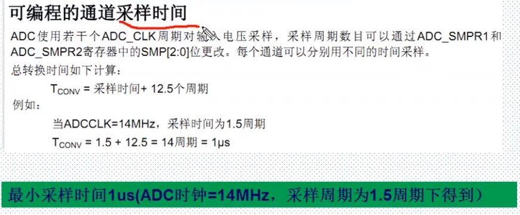

# ADC

## [正点原子 ADC](https://www.bilibili.com/video/BV1Lx411Z7Qa?p=43)

ADC (Analog-to-Digital Converter)的缩写。指模/数转换器或者模拟/数字转换器。是指连续变量的模拟信号转换为离散的数字信号的器件，典型的模拟数字转换器将模拟信号转换为表示一定比例电压值的数字信号。

### STM32F10x ADC的特点

- 12位逐次逼近型的模拟数字转换器
- 最多带3个ADC控制器
- 最多支持18个通道，可最多测量16个外部和2个内部信号源
- 支持单次和连续转换模式
- 转换结束，注入转换结束，和发生模拟看门狗事件产生中断。
- 通道0到通道n的自动扫描模式
- 自动校准
- 采样间隔可以通道编程
- 规则通道和注入通道均有外部触发选项
- 转换结果支持左对齐或右对齐方式存储在16位数据寄存器
- ADC转换时间：最大转换速率1us。（最大转换速度位1MHz，在ADCCLK=14M,采样周期位1.5个ADC时钟下得到的。）
- ADC供电要求：2.4V-3.6V
- ADC输入范围

STM32F10x大容量芯片带3个ADC控制器。其中144脚芯片带PF脚，所以多5个通道，为21个外部通道。小于144脚芯片只有16个外部通道。

### STM32F10x系列芯片ADC通道和引脚对应关系

|  | ADC1 | ADC2 | ADC3 |
| :--: | :--: | :--: | :--: |
| 通道 0 | PA0 | PA0 | PA0 |
| 通道 1 | PA1 | PA1 | PA1 |
| 通道 2 | PA2 | PA2 | PA2 |
| 通道 3 | PA3 | PA3 | PA3 |
| 通道 4 | PA4 | PA4 | PF6 |
| 通道 5 | PA5 | PA5 | PF7 |
| 通道 6 | PA6 | PA6 | PF8 |
| 通道 7 | PA7 | PA7 | PF9 |
| 通道 8 | PB0 | PB0 | PF10 |
| 通道 9 | PB1 | PB1 |  |
| 通道 10 | PC0 | PC0 | PC0 |
| 通道 11 | PC1 | PC1 | PC1 |
| 通道 12 | PC2 | PC2 | PC2 |
| 通道 13 | PC3 | PC3 | PC3 |
| 通道 14 | PC4 | PC4 |  |
| 通道 15 | PC5 | PC5 |  |
| 通道 16 | 温度传感器 |  |  |
| 通道 17 | 内部参照电压 |  |  |

### STM32通道组

1. 规则通道组：相当正常运行的程序。最多16个通道。规则通道和它的转换顺序在ADC_SQRx寄存器中选择，规则组转换的总数应写入ADC_SQR1寄存器的L[3:0]中
2. 注入通道组：相当于中断。最多4个通道。注入组和它的转换顺序在ADC_JSQR寄存器中选择。注入组里转化的总数应写入ADC_JSQR寄存器的L[1:0]中

### 单次转化与连续转换

单次转换模式

- 单次转换模式下，ADC只执行一次转换。该模式既可以通过设置ADC_CR2寄存器的ADON位（适用于规则通道）启动也可以通过外部触发启动（适用于规则通道或注入通道），这时CONT位为0。一旦选择通道的转换完成：
  - 如果一个规则通道被转换：转换数据被存储在16位ADC_DR寄存器中，EOC（转换结束）标志被设置，如果设置了EOCIE，则产生中断
  - 如果一个注入通道被转换：转换数据被存储在16位的ADC_DRJ1寄存器中，JEOC（注入转换结束）标志被设置，如果设置了JEOCIE位，则产生中断。

扫描模式

- 此模式用来扫描一组模拟通道，扫描模式可通过设置ADC_CR1寄存器的SCAN位来选择。一旦这个位被设置，ADC扫描所有被ADC_SQRX寄存器（对规则通道）或ADC_JSQR（对注入通道）选中的所有通道。在每个组的每个通道上执行单词转换。在每个转化结束时，同一组的下一个通道被自动转换。如果设置了CONT位，转换不会在选择组的最后一个通道上停止，而是再次从选择组的第一个通道继续转换。
- 如果设置了DMA位，在每次EOC后，DMA控制器把规则组通道的转换数据传输到SRAM中。而注入通道转换的数据总是存储在ADC_JDRx寄存器中。

### ADC中断

规则和注入组转换结束时能产生中断。它们都有独立的中断使能位。

- ADC1和ADC2的中断映射在同一个中断向量上，而ADC3的中断有自己的中断向量。ADC_SR寄存器中有2个其他标志，但是它们没有相关的中断：
  - JSTRT（注入组通道转换的启动）
  - STRT（规则组通道转换的启动）

| 中断事件 | 事件标志 | 使能控制位 |
| :--: | :--: | :--: |
| 规则组转换结束 | EOC | EOCIE |
| 注入组转化结束 | JEOC | JEOCIE |
| 设置了模拟看门狗状态位 | AWD | AWDIE |

### ADC时钟配置

时钟配置寄存器（RCC_CFGR）

| 位15:14 | ADCPRE[1:0]:ADC预分频（ADC prescaler）由软件置‘1’或清‘0’来确定ADC时钟频率 |
|:--:|:--|

- 不要让ADC时钟超过14MHz，否则可能不准。

```RCC_ADCCLKConfig(RCC_PCLK2_Div6);```

### ADC采样时间



### 常用库函数

```C
typedef struct
{
  uint32_t ADC_Mode;  //ADC模式                   

  FunctionalState ADC_ScanConvMode;     //是否使用扫描模式

  FunctionalState ADC_ContinuousConvMode; //单次转换OR连续转化

  uint32_t ADC_ExternalTrigConv;   //触发方式       

  uint32_t ADC_DataAlign;    //对齐方式             

  uint8_t ADC_NbrOfChannel;  //规则通道序列长度             
}ADC_InitTypeDef;

void ADC_DeInit(ADC_TypeDef* ADCx);
void ADC_Init(ADC_TypeDef* ADCx, ADC_InitTypeDef* ADC_InitStruct);
void ADC_StructInit(ADC_InitTypeDef* ADC_InitStruct);
void ADC_Cmd(ADC_TypeDef* ADCx, FunctionalState NewState);//使能指定的ADC
void ADC_DMACmd(ADC_TypeDef* ADCx, FunctionalState NewState);
void ADC_ITConfig(ADC_TypeDef* ADCx, uint16_t ADC_IT, FunctionalState NewState);
void ADC_ResetCalibration(ADC_TypeDef* ADCx);
FlagStatus ADC_GetResetCalibrationStatus(ADC_TypeDef* ADCx);
void ADC_StartCalibration(ADC_TypeDef* ADCx);
FlagStatus ADC_GetCalibrationStatus(ADC_TypeDef* ADCx);
void ADC_SoftwareStartConvCmd(ADC_TypeDef* ADCx, FunctionalState NewState);//使能软件转换函数ADC
FlagStatus ADC_GetSoftwareStartConvStatus(ADC_TypeDef* ADCx);//获取转换结果函数
void ADC_DiscModeChannelCountConfig(ADC_TypeDef* ADCx, uint8_t Number);
void ADC_DiscModeCmd(ADC_TypeDef* ADCx, FunctionalState NewState);
void ADC_RegularChannelConfig(ADC_TypeDef* ADCx, uint8_t ADC_Channel, uint8_t Rank, uint8_t ADC_SampleTime);//规则通道配置
void ADC_ExternalTrigConvCmd(ADC_TypeDef* ADCx, FunctionalState NewState);
uint16_t ADC_GetConversionValue(ADC_TypeDef* ADCx);
uint32_t ADC_GetDualModeConversionValue(void);
void ADC_AutoInjectedConvCmd(ADC_TypeDef* ADCx, FunctionalState NewState);
void ADC_InjectedDiscModeCmd(ADC_TypeDef* ADCx, FunctionalState NewState);
void ADC_ExternalTrigInjectedConvConfig(ADC_TypeDef* ADCx, uint32_t ADC_ExternalTrigInjecConv);
void ADC_ExternalTrigInjectedConvCmd(ADC_TypeDef* ADCx, FunctionalState NewState);
void ADC_SoftwareStartInjectedConvCmd(ADC_TypeDef* ADCx, FunctionalState NewState);
FlagStatus ADC_GetSoftwareStartInjectedConvCmdStatus(ADC_TypeDef* ADCx);
void ADC_InjectedChannelConfig(ADC_TypeDef* ADCx, uint8_t ADC_Channel, uint8_t Rank, uint8_t ADC_SampleTime);
void ADC_InjectedSequencerLengthConfig(ADC_TypeDef* ADCx, uint8_t Length);
void ADC_SetInjectedOffset(ADC_TypeDef* ADCx, uint8_t ADC_InjectedChannel, uint16_t Offset);
uint16_t ADC_GetInjectedConversionValue(ADC_TypeDef* ADCx, uint8_t ADC_InjectedChannel);
void ADC_AnalogWatchdogCmd(ADC_TypeDef* ADCx, uint32_t ADC_AnalogWatchdog);
void ADC_AnalogWatchdogThresholdsConfig(ADC_TypeDef* ADCx, uint16_t HighThreshold, uint16_t LowThreshold);
void ADC_AnalogWatchdogSingleChannelConfig(ADC_TypeDef* ADCx, uint8_t ADC_Channel);
void ADC_TempSensorVrefintCmd(FunctionalState NewState);
FlagStatus ADC_GetFlagStatus(ADC_TypeDef* ADCx, uint8_t ADC_FLAG);
void ADC_ClearFlag(ADC_TypeDef* ADCx, uint8_t ADC_FLAG);
ITStatus ADC_GetITStatus(ADC_TypeDef* ADCx, uint16_t ADC_IT);
void ADC_ClearITPendingBit(ADC_TypeDef* ADCx, uint16_t ADC_IT);
```
