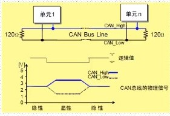
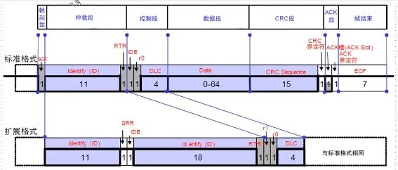
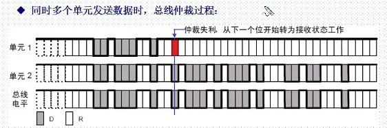
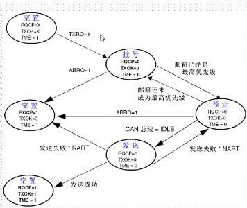
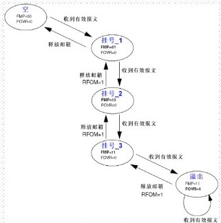
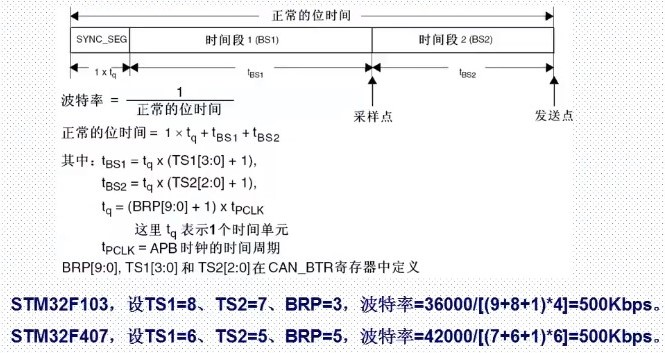

# CAN

## [CAN 通信](https://www.bilibili.com/video/BV1Lx411Z7Qa?p=55)

[1. CAN基础知识](#can基础知识)

[2. STM32 CAN控制器简介](#stm32-can控制器简介)

[3. 源码](#源码)

[4. 实验](#实验)

## CAN基础知识

- CAN是Controller Area Network的缩写，是ISO国际标准化的串行通信协议。
- CAN具有很高的可靠信，广泛应用于：汽车电子、工业自动化、船舶、医疗设备、工业设备等方面。

### CAN的特点

- 多主控制，总线空闲时，所有单元都可发送消息，而两个以上的单元同时开始发送消息时，根据标识符决定优先级。两个以上的单元同时发送消息时，对各消息ID的每个位进行逐个仲裁比较。仲裁获胜的单元继续发送消息，仲裁失利的单元立即停止发送而进行接收工作。
- 系统柔软性，连接总线单元，没有类似“地址”的信息，因此在总线上添加单元时，已连接的其他单元的软硬件和应用层都不需要做出改变。
- 速度快，距离远。
- 具有错误检测、错误通知和错误恢复功能。左右单元都可以检测错误（错误检测功能），检测出错误的单元会立即同时通知其他所有单元（错误通知功能），正在发送消息的单元一旦检测出错误，会强制结束当前的发送。强制结束发送的单元会不断反复地重新发送此消息直到成功发送为止（错误恢复功能）。
- 故障封闭功能。CAN可以判断出错误的类型是总线上暂时的数据错误（如外部噪声）还是持续的数据错误（如单元内部故障、驱动故障、断线等）。由此功能，当总线上发生持续数据错误时，节将引起此故障的单元从总线上隔离出去。
- 连接节点多。CAN总线是可同时连接多个单元的总线。可连接的单元总数理论上是没有限制的，但实际上可连接的单元数受总线上的时间延迟及电气负载的限制。降低通信速度，可连接的单元数增加；提高通信速度，则可连接的单元数减少。

### CAN物理层



- CAN控制器根据CAN_L和CAN_H上的电位差判断总线电平。总线电平分为显性电平和隐性电平。发送方通过使总线电平发生变化，将消息发送给接收方。

  - 显性电平对应逻辑：0，CAN_H和CAN_L之差为2V左右
  - 隐性电平对应逻辑：1，CAN_H和CAN_L之差为0V左右

- 显性电平具有优先权，只要有一个单元输出显性电平，总线上位显性电平。另外在CAN总线上的起止端都有一个120Ω的终端电阻，来做阻抗匹配，以减少回波反射。

### CAN帧种类

- CAN通信主要是以下5种类型

| 帧类型 | 帧用途 |
| --- | :--: |
| 数据帧 | 用于发送单元向接收单元传送数据的帧 |
| 遥控帧 | 用于接收单元向具有相同ID的发送单元请求数据的帧 |
| 错误帧 | 用于当检测出错误时向其他单元通知错误的帧 |
| 过载帧 | 用于接收单元通知其他尚未做好接收准备的帧 |
| 间隔帧 | 用于将数据帧及遥控帧与前面的帧分离开来的帧 |

- 数据帧和遥控帧有便准格式和拓展格式，其中标准格式有11位的标识符ID，拓展格式有29位的ID。

### 数据帧

- 帧起始，表示数据帧开始的段
- 仲裁段，表示该帧优先级的段
- 控制段，表示数据的字节数及保留位的段
- 数据段，数据的内容，一帧可发送0~8个字节的数据
- CRC段，检查帧的传输错误的段
- ACK段，表示确认正常接收的段
- 帧结束，表示数据帧结束的段



- 帧起始。标准帧和拓展帧都是由一位的显性电平表示帧起始

- ID：高位在前，低位在后。基本ID，禁止高7位都为隐性，即不能：ID=1111111XXXX
- RTR，远程请求位。0：数据帧；1：远程帧；
- SRR，替代远程请求位。设置为1（隐性电平）
- IDE，标识符选择位。0：标准标识符；1：拓展标识符

### 总线仲裁



- 总线空闲时，最先发送的单元获得发送优先权，一旦发送，其他单元无法抢占。如果多个单元同时发送，则连续输出显性电平多的单元，具有较高的优先级。
- 从ID开始比较，如果ID相同，还可能会比较RTR和SRR等位

### 位时序

- 位速率。由发送单元在非同步的情况下发送每秒钟的位数称为位速率。一个位一般可以分为如下四段：
  - 同步段（SS）
  - 传播时间段（PTS）
  - 相位缓冲段1（PBS1）
  - 相位缓冲段2（PBS2）

- 这些段有由可称为Time Quantum 的最小时间单位构成。1位分为4个段，每个段又由若干个Tq构成，这称为位时序。

- 位时序各段的作用和Tq数

| 段名称 | 段的作用 | Tq数 |
| :--: | :-- | :--: |
|同步段（SS：Synchronization Segment） | 多个连接在总线上的单元通过此段实现时序调整，同步进行接收和发送的工作，有隐性电平到显性电平的边沿或由显性电平到隐性电平的边沿最好出现在此段 | 1Tq |
|传播时间段（PTS：Propagation Time Segment） | 用于吸收网络上的物理延迟的段。所谓的网络的物理延迟指发送单元的输出延迟、总线上信号的传播延迟、接收单元的输入延迟。这个段的时间位以上各延迟时间和的两倍 | 1~8Tq |
| 相位缓冲段1（PBS1：Phase Buffer Segment 1） | 当信号边沿不能被包含于SS段中时，可在此段进行补偿。由于各单元以各自独立的时钟工作，细微的时钟误差会累积，PBS段可用于吸收此误差。通过对相位缓冲段加减SJW吸收误差，SJW加大后允许误差加大，但通信速度下降 | 1~8Tq |
| 相位缓冲段1（PBS2：Phase Buffer Segment 2） | 同上 | 2~8Tq |
| 再同步补偿宽度（SJW：reSynchronization Jump Width） | 因时钟频率偏差、传送延迟等，各单元有同步误差。SJW位补偿此误差的最大值 | 1~4Tq |

## STM32 CAN控制器简介

### bxCAN

- STM32自带了基本拓展CAN外设，又称bxCAN，bxCAN的特点如下：

  - 支持CAN协议2.0A和2.0B主动模式
  - 波特率最高达1Mbps
  - 支持时间触发通信
  - 具有3个发送邮箱
  - 具有3级深度的2个接收FIFO
  - 可变的筛选器组（也称过滤器组，最高28个）

### 模式

- 工作模式（通过CAN_MCR寄存器控制INRQ和SLEEP）

  - 初始化模式（INRQ = 1，SLEEP = 0）
  - 正常模式（INRQ = 0， SLEEP = 0）
  - 睡眠模式（SLEEP=1）

- 测试模式（通过CAN_BTR寄存器控制LBKM和SILM）

  - 静默模式（LBKM = 0，SILM = 1）
  - 环回模式（LBKM = 1，SILM = 0）
  - 环回静默模式（LBKM = 1，SILM = 1）

- 调试模式

### 标识符筛选器

- CAN的标识符不表示目的地址而是表示发送优先级。接收节点根据标识符的值，来决定是否接收对应消息。
- STM32 CAN控制器，提供了28个可配置的筛选器组（F1仅互联型才有28个，其他的只有14个），可降低CPU处理CAN通信的开销
- STM32 CAN控制器每个筛选器组由2个32位寄存器组成（CAN_FxR1和CAN_FxR2，x=0~27）根据位宽不同，每个筛选器组可提供：
  - 1个32位筛选器，包括STDID[10:0]、EXTID[17:0]、IDE和RTR位
  - 2个16位筛选器，包括STDID[10:0]、IDE、RTR和EXTID[17:15]位

- 筛选器可配置为：屏蔽位模式和标识符列表模式。在屏蔽位模式下，标识符寄存器和屏蔽寄存器一起，指定报文标识符的任何一位，应该按照“必须匹配”或“不用关心”处理。而在标识符列表模式下，屏蔽寄存器也被当做标识符寄存器使用。因此，不是采用一个标识符加一个屏蔽位的方式，而是使用2个标识符寄存器。接收报文标识符的每一位都必须跟筛选器标识符相同。

### CAN发送流程



- 程序选择1个控制的邮箱（TME = 1）->设置标识符（ID）,数据长度和发送数据->设置CAN_TIxR的TXRQ位为1，请求发送->邮箱挂号（等待称为最高优先级）->预定发送（等待总线空闲）->发送->邮箱空置。

### CAN接收流程



- FIFO空->收到有效报文->挂号_1(存入FIFO的一个邮箱，这个有硬件控制，我们不需要理会)->收到有效报文->挂号_2->收到有效报文->挂号3->收到有效报文->溢出。
- CAN收到的有效报文，存储在3级邮箱深度的FIFO中。FIFO接收到的报文数，我们可以通过查询CAN_PFxR的FMP寄存器来得到，只要FMP不为0，我们就可以从FIFO读出收到的报文。
  - 报文FIFIO具有锁定功能（由CAN_MCR，RFLM位控制），锁定后，新数据将丢弃，不锁定则新数据将替代老数据

### CAN位时序



- STM32的CAN将传播时间段和相位缓冲时间段1合并成时间段1

### CAN初始化流程

- 配置相关引脚的复用功能，使能CAN时钟。
  - 要用CAN，先要使能CAN的时钟，CAN的时钟通过APB1ENR的第25位来设置。其次要设置CAN的相关引脚为复用输出，这里我们需要设置PA11位上拉输入（CAN_RX）PA12为复用输出（CAN_TX引脚），并使能PA口的时钟

- 设置CAN工作模式及波特率等。
  - 通过先设置CAN_MCR寄存器的INRQ位，让CAN进入初始化模式，然后设置CAN_MCR的其他相关控制位。再通过CAN_BTR设置波特率和工作模式（正常模式/环回模式）等信息。最后设置INRQ为0，退出初始化模式

- 设置滤波器。

## 源码

### 初始化函数

- CNA初始化函数

```C
u8 CAN1_Mode_Init(u8 tsjw, u8 tbs2, u8 tbs1, u16 brp, u8 mode)
```

- 发送函数

```C
//can发送一组数据(固定格式0x12，标准帧，数据帧)
//len：数据长度
//msg：数据指针，最大8个字节

u8 Can_Send_Msg(u8* msg, u8 len)
{
  u8 mbox;
  u16 i = 0;
  CanTxMsg TxMessage;
  TxMessage.Stdld = 0x12;           //标准标识符
  TxMessage.Extld = 0x12;           //设置拓展标识符
  TxMessage.IDE = CAN_Id_Standard;  //标准帧
  TxMessage.RTR = CAN_RTR_Data;     //数据帧
  TxMessage.DLC = len;              //要发送的数据长度

  for(i = 0; i < len; i++)
  {
    TxMessage.Data[i] = msg[i];
  }
  mbox = CAN_Transmit(CAN1, &TxMessage);
  i = 0;
  while((CAN_TransmitStatus(CAN1, mbox) == CAN_TxStatus_Failes) && (i < 0xFFF))
  {
    i++
  }

  if(i >= 0xFFF)return 1;
  return 0;
}
```

## 实验
