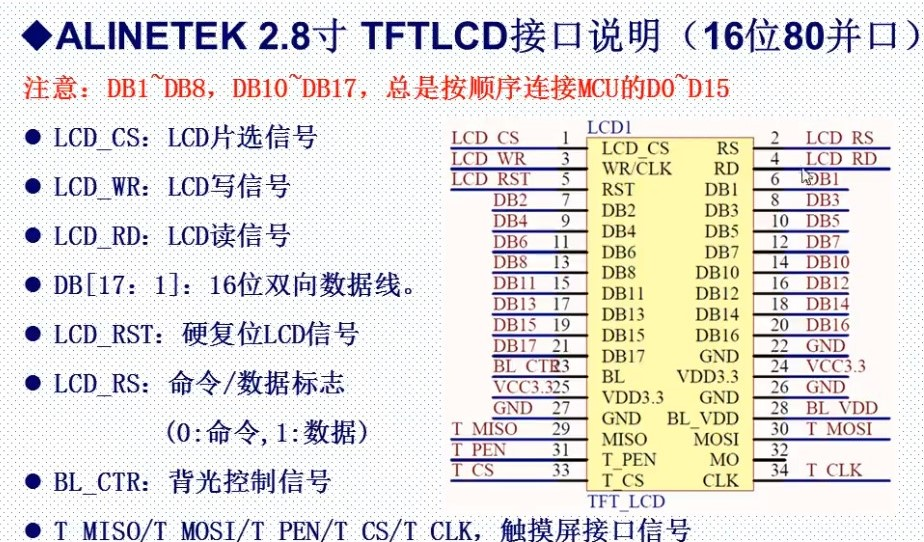

# LCD

## [正点原子 LCD](https://www.bilibili.com/video/BV1Lx411Z7Qa?p=36)

## [1. TFTLCD驱动原理](#tftlcd驱动原理)

## [2. FSMC简介](#fsmc简介)

## [3. 源码](#3-源码)

## TFTLCD驱动原理

### TFTLCD驱动原理-简介

- TFTLCD即薄膜晶体液晶显示器。它与无源TN-LCD、STN-LCD的简单矩阵不同，它在液晶显示屏的每一个像素上都设置有一个薄膜晶体管（TFT），可有效地克服非选通时的串扰，使显示液晶屏的静态特性与扫描线数无关，因此大大提高了图像质量

- TFTLCD具有：亮度好、对比度高、层次感强、颜色鲜艳等特点。是目前最主流的LCD显示器。广泛应用于电视、手机、电脑、平板等各种电子产品。

### ALINETEK 2.8寸 TFTLCD 16位80并口驱动简介

- 模块的8080并口读/写的过程：先根据要写入/读取的数据类型，设置RS为高（数据）/低（命令），然后拉低片选，选中ILI9341，接着我们根据是读数据，还是写数据RD/WR为低，然后
  - 读数据：在RD的上升沿，读取数据线上的数据D[15:0]
  - 写数据：在WR的上升沿，使数据写入到ILI9341里面

## FSMC简介

- FSMC，即灵活的静态存储控制器，能够与同步或异步存储器和16位PC存储器卡连接，STM32的FSMC接口支持包括SRAM、NAND FLASH、NOR FLASH和PSRAM等存储器

### FSMC驱动LCD原理

- FSMC驱动外部SRAM时，外部SRAM的控制一般有：地址线、数据线、写信号、读信号、片选信号，如果SRAM支持字节控制，那么还有UB/LB信号。
- TFTLCD通过RS信号决定传送的数据是数据还是命令，本质上可以理解位一个地址信号，比如我们把RS接在A0上面，那么当FSMC控制器写地址0的时候，会使得A0变为0，对TFTLCD来说，就是写数据。这样就把数据和命令区分开了，他们其实就是对应SRAM操作的两个连续地址。当然RS也可以接在其他地址线上。
- 因此，可以把TFTLCD当成一个SRAM来用，只不过这个SRAM有2个地址，这就是FSMC可以驱动LCD的原理。

- STM32的FSMC存储块1（Bank1）用于驱动NOR FLASH/SRAM/PSRAM，被分为4个区，每个区管理64M字节空间，每个区都有独立的寄存器对所连接的存储器进行配置。Bank1的256M字节空间由28根地址线（HADDR[27:0]）寻址。
- HADDR：是内部AHB地址总线，其中，HADDR[25:0]来自外部存储器地址FSMC_A[25:0]，而HADDR[26:27]对4个区进行寻址。
  - 当Bank1接的是16位宽度存储器的时候：HADDR[25:1]->FSMC_A[24:0]
  - 当Bank1接的是8位宽度存储器的时候：HADDR[25:0]->FSMC_A[25:0]
  - 不论外部接8位/16位宽设备，FSMC_A[0]永远接在外部设备地址A[0]

### 寄存器介绍

- 对于NOR FLASH/PSRAM控制器（存储块1），通过FSMC_BCRx、FSMC_BTRx和FSMC_BWTRx寄存器设置（其中x=1~4，对应4个区）。通过3个寄存器，可以设置FSMC访问外部存储器的时序参数，拓宽了可选用的外部存储器的速度范围

## 源码
