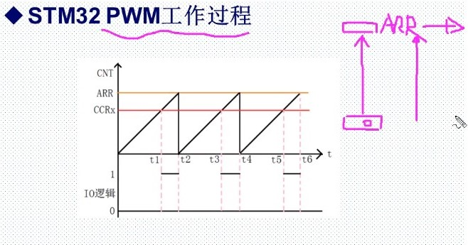
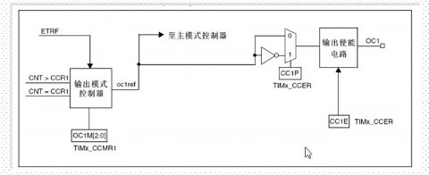

# PWM输出

## [正点原子 定时器PWM](https://www.bilibili.com/video/BV1Lx411Z7Qa?p=32)

## 通用定时器PWM

### STM32 PWM工作过程





- CRR1:捕获比较（值）寄存器（x = 1，2，3，4）
- CCMR1:OC1M[2:0]位：
  - 对于PWM方式下，用于设置PWM模式1[110]或者PWM模式2[111]

- CCER:CC1P位：输入/捕获1输出极性。0：高电平有效，1：低电平有效。
- CCER:CC1E位：输入/捕获1输出使能。0：关闭，1：打开

- 向上计数配置，当TIMx_CR1寄存器中的DIR位为低的时候执行向上计数。

### PWM模式

- 脉冲宽度调制模式可以产生一个有TIMx_ARR寄存器确定频率、有TIMx_CRRx寄存器确定占空比的型号。
- 在TIMx_CCMRx寄存器中的OCxM位写入'110'(PWM模式1)或'111'（PWM模式2），能够独立地设置每个OCx输出通道产生一路PWM。必须设置TIMx_CCMRx寄存器OCxPE位以使能相应的预装载寄存器，最后还要设置TIMx_CR1寄存器的ARPE位，(在向上计数或中心对称模式中)使能自动重装载的预装载寄存器。

```C
void TIM_OC2PreloadConfig(TIM_TypeDef* TIMx,uint16_t TIM_OCPreload);
vodi TIM_ARRPreloadConfig(TIM_TypeDef* TIMx,FunctionalState NewState);
//简单的，ARPE = 1，ARR立即生效
// ARPE = 0，ARR下个比较周期生效
```

### 定时器3输出通道引脚

| 复用功能 | TIM3_REMAP[1:0]=00没有重映像 | TIM3_REMAP[1:0]=10部分重映像 | TIM3_REMAP[1:0]=11完全重映像 |
| :--: | :--: | :--: | :--: |
| TIM3_CH1 | PA6 | PB4 | PC6 |
| TIM3_CH2 | PA7 | PB5 | PC7 |
| TIM3_CH3 | PB0 | PB0 | PC8 |
| TIM3_CH4 | PB1 | PB1 | PC9 |

## 常用寄存器和库函数配置

### 库函数配置

- PWM输出库函数

```C
void TIM_OCxInit(TIM_TypeDef* TIMx,TIM_OCInitTypeDef* TIM_OCInitStruct);

typedef struct
{
    uint16_t TIM_OCMode;        //PWM模式1或者模式2
    uint16_t TIM_OutputState;   //输出使能OR失能
    uint16_t TIM_OutputNState;
    uint16_t TIM_Pulse;         //比较值，写CCRx
    uint16_t TIM_OCPolarity;    //比较输出极性
    uint16_t TIM_OCNPolarity;
    uint16_t TIM_OCIdleState;
    uint16_t TIM_OCNIdleState;
}TIM_OCinitTypeDef;

TIM_OCInitStruct.TIM_OCMode = TIM_OCMode_PWM2;  //PWM模式2
//比较输出使能
TIM_OCInitStruct.TIM_OutputState = TIM_OutputState_Enable；
TIM_OCInitStruct.TIM_Pulse = 100;
//输出极性：TIM输出比较极性高
TIM_OCInitStruct.TIM_OCPolarity = TIM_OCPolarity_High;
TIM_OC2Init(TIM3, &TIM_OCInitStructure);//根据T指定的参数初始化外设TIM3 OC2
```

- 设置比较值函数

```void TIM_SetCompareX(TIM_TypeDef* TIMx, uint16_t Compare2);```

- 使能输出比较预装载

```void TIM_OC2PreloadConfig(TIM_TypeDef* TIMx, uint16_t TIM_OCPreload);```

- 使能自动重装载的预装载寄存器允许位

```void TIM_ARRPreloadConfig(TIM_TypeDef* TIMx, FunctionalState NewState);```

### PWM输出配置步骤

- 使能定时器3和相关IO口时钟。
  - 使能定时器3时钟：RCC_APB1PeriphClockCmd();
  - 使能GPIOB时钟：RCC_APB2PeriphClockCmd();

- 初始化IO口为复用功能输出。函数:GPIO_Init();
  - GPIO_InitStruct.Gpio_Mode = Gpio_Mode_AF_PP;

- 把PB5用作定时器的PWM输出引脚，所以要重映射配置，所以需要开启AFIO时钟。同时设置重映射
  - RCC_APB2PeriphClockCmd(RCC_APB2Periph_AFIO, ENABLE);
  - GPIO_PinRemapConfig(GPIO_PartialRemap_TIM3, ENABLE);

- 初始化定时器:ARR,PSC:TIM_TimeBaseInit();
- 初始化输出比较参数：TIM_OC2Init();
- 使能预装载寄存器：TIM_OC2PreloadConfig(TIM3, TIM_OCPreload_Enable);
- 是使能定时器 TIM_Cmd();
- 不断改变比较值CCRx，达到不同的占空比效果TIM_SetCompare2();
