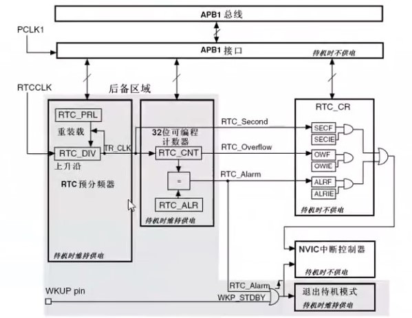

# RTC实时时钟

## [正点原子 RTC](https://www.bilibili.com/video/BV1Lx411Z7Qa?p=40)

## [1.RTC实时时钟特征与原型](#RTC实时时钟特征与原型)

## [2.BKP备份寄存器原理](#BKP备份寄存器原理)

## [3.RTC常用寄存器+库函数](#RTC常用寄存器库函数)

## RTC实时时钟特征与原型

- RTC是一个独立的定时器。RTC模块拥有一个连续计数的计数器，在相应的软件配置下，可以特供时钟日历的功能。修改计数器的值可以重新设置当前时间和日期。

- RTC模块和时钟配置系统（RCC_BDCR寄存器）是在后备区域，即在系统复位或从待机模式唤醒后RTC的设置和时间维持不变。但是在系统复位后，会自动禁止访问后备寄存器和RTC，以防止对后备区域BKP的意外写操作。所以在要设置时间之前，先要取消备份区域BKP写保护。

### RTC特征

- 可编程的预分频系数：分频系数最高为2^20
- 32位的可编程计数器，可用于较长时间段的测量
- 2个分离的时钟：用于APB1接口的PCLK1和RTC时钟（RTC时钟的频率必须小于PCLK1时钟频率的四分之一以上）
- 可以选择以下RTC的时钟源：
  - HSE时钟除以128
  - LSE振荡器时钟
  - LSI振荡器时钟

- 2个独立的复位类型
  - APB1接口有系统复位
  - RTC核心（预分频器、闹钟、计数器和分频器）只能由后备域复位

- 3个专门的可屏蔽中断：
  - 闹钟中断，用来产生一个软件可编程的闹钟中断
  - 秒中断，用来产生一个可编程的周期性中断信号（最长可达1秒）
  - 溢出中断，指示内部可编程计数器溢出并回转为0的状态




### RTC

- RTC由两部分组成

  - APB1接口：用来和APB1总线相连。通过APB1接口可以访问RTC的相关寄存器（预分频值，计数器值，闹钟值）
  - RTC核心：由一组可编程计数器组成。
  1. 第一个是RTC预分频模块，它可以编程产生最长1秒的RTC时间基TR_CLK。如果设置了秒中断允许位，可以产生秒中断
  2. 第二个是32位可编程计数器，可被初始化为当前时间。系统时间按TR_CLK周期累加并与存储在RTC_ALR寄存器中的可编程时间相比，
  3. 当匹配时候如果设置了闹钟中断允许位，可以产生闹钟中断。

- RTC内核完全独立于APB1接口，软件通过APB1接口对RTC相关寄存器访问。但是相关寄存器只在RTCAPB1时钟进行重新同步的RTC时钟的上升沿被更新。所以软件必须先等待寄存器同步标志位（RTC_CRL的RSF位）被硬件置1才读。

## BKP备份寄存器原理

- 备份寄存器是42个16位的寄存器。可用来存储84个字节数据
- 他们处在备份区域，当VDD电源切断，仍然由VBAT维持供电
- 当系统在待机模式下被唤醒，或者系统复位或者电源复位，他们也不会复位
- 执行以下操作将使能对后备寄存器和RTC访问：
  - 设置寄存器RCC_APB1ENR的PWREN和BKPEN位，使能电源和后备时钟。
  - 设置寄存器PWR_CR的DBP位，使能对RTC和后备寄存器的访问。

## RTC常用寄存器+库函数

### RTC相关寄存器

- RTC控制寄存器（RTC_CRH，RTC_CRL）
- RTC预分频装载寄存器（RTC_PRLH，RTC_PRLL）
- RTC预分频余数寄存器（RTC_DIVH，RTC_DIVL）
- RTC计数器寄存器（RTC_CNTH，RTC_CNTL）
- RTC闹钟寄存器（RTC_ALRH，RTC_ALRL）

### 常用寄存器

- 修改CRH/CRL寄存器，必须先判断RSF位，确定已经同步
- 修改CNT，ALR/PRL的时候，必须先配置CNF位进入配置模式，修改完之后，设置CNF位为0，退出配置模式
- 同时再对RTC相关寄存器写操作之前，必须判断上一次写操作已经结束，也就是判断RTODD位是否置位。

```C
void RTC_ITConfig(uint16_t RTC_IT, FunctionalState NewState);
void RTC_EnterConfigMode(void);
void RTC_ExitConfigMode(void);
uint32_t  RTC_GetCounter(void);
void RTC_SetCounter(uint32_t CounterValue);
void RTC_SetPrescaler(uint32_t PrescalerValue);
void RTC_SetAlarm(uint32_t AlarmValue);
uint32_t  RTC_GetDivider(void);
void RTC_WaitForLastTask(void);
void RTC_WaitForSynchro(void);
FlagStatus RTC_GetFlagStatus(uint16_t RTC_FLAG);
void RTC_ClearFlag(uint16_t RTC_FLAG);
ITStatus RTC_GetITStatus(uint16_t RTC_IT);
void RTC_ClearITPendingBit(uint16_t RTC_IT);
```

- RTC配置一般步骤

1. 使能PWR和BKP时钟 RCC_APB1PeriphClockCmd();
2. 使能后备寄存器访问   PWR_BackupAccessCmd();
3. 配置RTC时钟源，使能RTC时钟
   - RCC_RTCCLKConfig();
   - RCC_RTCCLKCmd();
   - 如果使用LSE，要打开LSE：RCC_LSEConfig(RCC_LSE_ON);
4. 设置RTC预分频系数    RTC_SetPrescaler();
5. 设置时间     RTC_SetCounter();
6. 开启相关中断     RTC_ITConfig();
7. 编写中断服务函数     RTC_IRQHandler();
8. 部分操作要等待写操作完成和同步
   - RTC_WaltForLastTask();
   - RTC_WaitForSynchro();  //等待RTC寄存器同步
