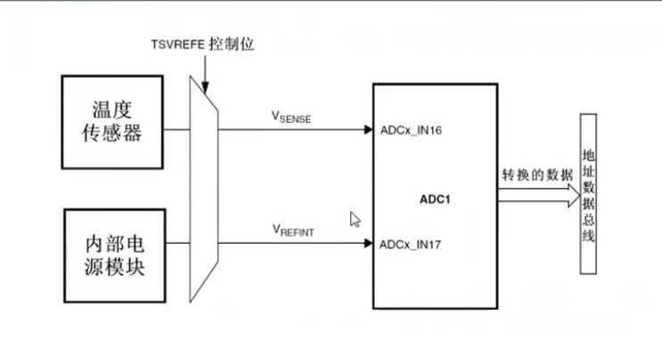

# 内部温度

## 光敏传感

## [温度传感器](https://www.bilibili.com/video/BV1Lx411Z7Qa?p=45)

### 内部温度传感器框图

### 内部温度传感器

- STM32有一个内部的温度传感器，可以用来测量CPU及周围的温度（TA）
- 该温度传感器在内部和ADCx_IN16输入通道相连接，此通道把传感器输出的电压转换成数字值。
- 温度传感器模拟输入推荐采样时间是17.1us
- STM32的内部温度传感器支持的温度范围为：-40~125度。精确比较差，误差1.5度左右。
- 内部温度传感器更适合检测温度的变化，而不是测量绝对温度。如果需要测量绝对温度，应该使用一个外部温度传感器。

### 内部温度传感器使用注意事项

- 使用STM32的内部温度传感器，必须先激活ADC内部通道，这里通过ADC_CR2的TSVREFE位（bit23）设置。设置改位为1则启用内部温度传感器
- STM32的内部温度传感器固定的连接在ADC的通道16上，所以，再设置好ADC之后只要读取通道16的值，就是温度传感器返回来的电压值。

T = {(V25 - Vsense) / Avg_Slope} + 25

### 开启内部温度传感器步骤

1. 选择ADC_IN16输入通道
2. 设置采样时间大于17.1us
3. 设置ADC_CR2的TSVREFE位，打开内部温度传感器
4. 设置ADON位启动转换
5. 读取ADC结果
6. 计算

### 光敏传感器

- 光敏传感器是常见的传感器之一，它的种类繁多，主要有：光电管、光电倍增管、光敏电阻、光敏三极管、太阳能电池、红外线传感器、紫外线传感器、光纤式光电传感器、色彩传感器、CCD和CMOS图像传感器等。光传感器是目前产量多、应用最广的传感器之一，它在自动控制和非电量电测技术占有非常重要的地位。

- 光敏传感器是利用光敏元件将光信号转换为电信号的传感器，它的敏感波长在可见光波长附近，包括红外线波长和紫外线波长。光传感器不只局限于对光的探测，他还可以作为探测元件组成其它非电量进行检测，只要将这些非电量转换为光信号的变化即可。

- 光敏二极管也叫光电二极管。光敏二极管与半导体二极管在结构上是类似的，其管芯是一个具有光敏特征的PN结，具有单向导电性，因此工作时需加上反向电压。无光照时，又很小的饱和反向漏电流，即暗点流，此时光敏二极管截止。当受到光照时，饱和反向漏电流大大增加，形成光电流，它随入射光强度的变化而变化。当光线照射PN结时，可以使PN结中产生一空穴对，使少数载流子的密度增加。这些载流子在反向电压下漂移，是反向电流增加。因此可以利用光照强弱来改变电路中的电流。
  - 简而言之：照射光敏二极管的光强不同，通过光敏二极管的电流大小就不同，所以可以通过检测电流大小，达到检测光强的目的，利用这个电流变化，串接一个电阻，就可以转换成电压的变化，从而通过ADC读取电压值，判断外部光线的强弱。 