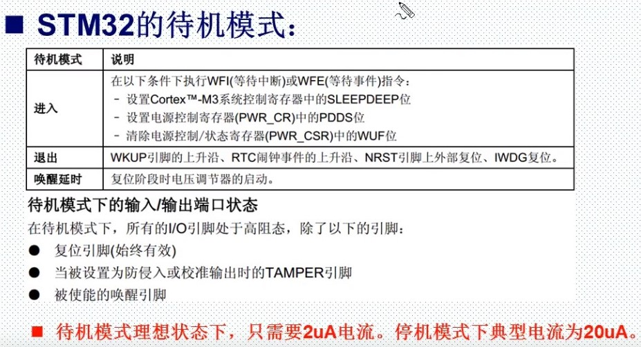

# WakeUp唤醒

## [正点原子 WakeUp唤醒](https://www.bilibili.com/video/BV1Lx411Z7Qa?p=42)

## [1.STM32低功耗模式讲解](#1stm32低功耗模式讲解)

## [2.寄存器和库函数配置](#2寄存器和库函数配置)

## STM32低功耗模式讲解

- 在系统或者电源复位后，微控制器出于运行状态之下，KCLK位CPU提供时钟，内核执行代码。当CPU不需要继续运行时，可以利用多种低功耗模式来省功耗，例如等待某个事件触发。

### STM32的3中低功耗模式

- 睡眠模式：内核停止，外设如NVIC，系统时钟Systick仍运行。
- 停止模式：所有时钟已停止。1.8V内核电源工作。PLL，HIS和HSE RC振荡器功能禁止。寄存器和SRAM内容保留
- 待机模式：1.8V内核电源关闭，只有备份寄存器和待机电路维持供电。寄存器和SRAM内容全部丢失，实现最低功耗。

在运行模式下可以通过：

- 降低系统时钟
- 关闭APB和AHB总线上未被使用的外设时钟

| 模式 | 进入 | 唤醒 | 对1.8V区域时钟影响 | 对VDD区域时钟影响 | 电压调节器 |
|:--:|:--:|:--:|:--:|:--:|:--:|
| 睡眠(SLEEP-NOW) | WFI | 任一中断 | CPU时钟关，对其他时钟和ADC时钟无影响 | 无 | 开 |
| 睡眠(SLEEP-ON-EXIT) | WFE | 唤醒事件 | CPU时钟关，对其他时钟和ADC时钟无影响 | 无 | 开 |
| 停机 | PDDS和LPDS位+SLEEPDEEP位+WFI或WFE | 任一外部中断（在外部寄存器中设置） | 关闭所有1.8V区域的时钟 | HSI和HSE的振荡器关闭 | 开启或处于低功耗模式（依据电源控制寄存器（PWR_CR）的设定）|
| 待机 | PDDS位+SLEEPDEEP位+WFI或WFE | WKUP引脚的上升沿、RTC闹钟事件、NRST引脚上的外部复位、IWDG复位 | 关闭所有1.8V区域的时钟 | HSI和HSE的振荡器关闭 | 关 |

- 用户根据最低电源消耗，最快启动时间和可用的唤醒源等条件，选择一种最佳的低功耗模式



## 寄存器和库函数配置

- 待机唤醒配置步骤

```C
//1. 使能电源时钟
RCC_APB1PeriphClockCmd(RCC_APB1Periph_PWR, ENABLE);
//2.设置WK_UP引脚作为唤醒源
PWR_WakeUpPinCmd(ENABLE);
//3.设置SLEEPDEEP位，设置PDDS位，执行WFI指令，进入待机模式
void PWR_EnterSTANDBYMode(void);
```

- 在待机模式下，WKUP用来唤醒，按下WKUP，就会从待机模式唤醒
- 正常情况下（没有进入低功耗模式），WKUP是可以作为正常的输入口，或者中断触发引脚来使用。
