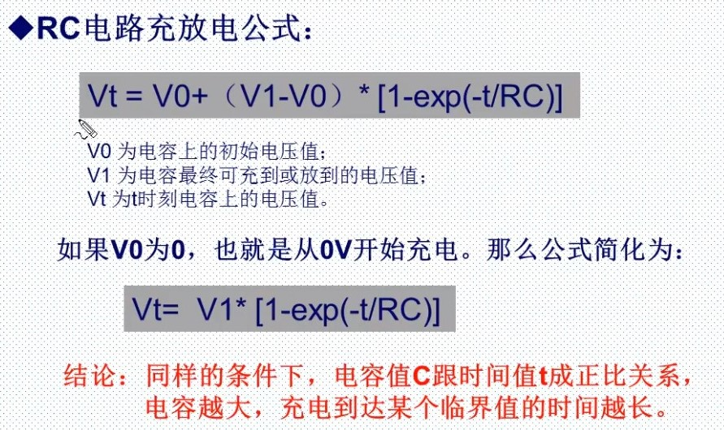
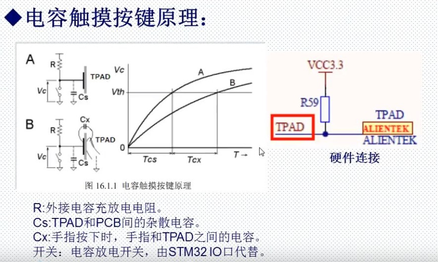

# 电容

## [正点原子 电容](https://www.bilibili.com/video/BV1Lx411Z7Qa?p=34)

## [1.电容触摸按键原理](#1电容触摸按键原理)

## [2.硬件连接](#2硬件连接)

## 电容触摸按键原理

### RC充放电路

### 检测电容触摸按键过程

- TPAD引脚设置为推挽输出，输出0，实现电容放电到0
- TPAD引脚设置为浮空输入（IO复位后的状态），电容开始充电
- 同时开启TPAD引脚的输入捕获开始捕获
- 等待充电完成（充电到底Vx，检测到上升沿）
- 计算充电时间

  - 没有按下的时候，充电时间为T1（default）。按下TPAD，电容变大，所以充电时间为T2。我们可以检测充放电时间，来判断是否按下。如果T2-T1大于某个值，就可以判断按键按下。

## 硬件连接

### 函数

- void TPAD_Reset(void)函数：复位TPAD
  - 设置IO为推挽输出，输出0，电容放电。等待放电完成之后，设置浮空输入，从而开始充电。同时吧计数器的CNT设置为0

- TPAD_Get_Val()函数：获取一次捕获值(得到充电时间)
  - 复位TPAD，等待捕获上升沿，捕获之后，得到定时器的值，计算充电时间

- TPAD_Get_MaxVal()函数
  - 多次调用TPAD_Get_Val函数获取充电时间。获取最大的值。