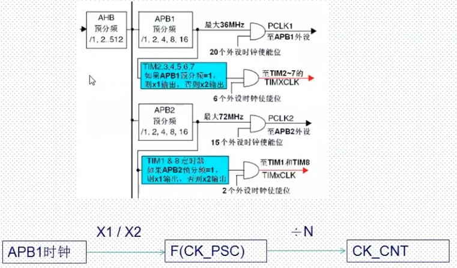

# 通用定时器

[通用定时器https://www.bilibili.com/video/BV1Lx411Z7Qa?p=30](https://www.bilibili.com/video/BV1Lx411Z7Qa?p=30)

[1 三种定时器的区别](#三种定时器的区别)

[2 通用定时器特点](#通用定时器功能特点描述)

[3 定时器中断实验](#定时器中断实验)

[4 常用库函数](#通用定时器常用的寄存器和库函数)

## 三种定时器的区别

- STM32F10X系列总共最多有8个定时器


## 通用定时器功能特点描述

- STM3的通用TIMx（TIM2、TIM3、TIM4、和TIM5）定时器功能特点包括

    1. 位于低速的APB1总线上（APB1）
    2. 16位向上、向下、向上/向下（中心对齐）计数模式，自动装载计数器（TIMx_CNT）。
    3. 16位可编程（可以实时修改）预分频器（TIMx_PSC），计数器时钟频率的分频系数位1 ~ 65535之间的任意数值。
    4. 4个独立通道（TIMx_CH 1 ~ 4），这些通道可以用来作为：

        - 输入捕获
        - 输出比较
        - PWM生成（边缘或中间对齐模式）
        - 单脉冲模式输出

    5. 可使用外部信号（TIMx_ETR）控制定时器和定时器互连（可以用1个定时器控制另外一个定时器）的同步电路。
    6. 事件发生时产生中断/DMA(6个独立的IRQ/DMA请求生成器)

       - 更新：计数器向上溢出/向下溢出，计数器初始化（通过软件或者内部/外部触发）
       - 触发事件（计数器启动、停止、初始化或者由内部/外部触发计数）
       - 输入捕获
       - 输出比较
       - 支持针对定位的增量（正交）编码器和霍尔传感器电路
       - 触发输入作为外部时钟或者按周期的电流管理

- STM32的通用定时器可以被用于：测量输入信号的脉冲长度（输入捕获）或者产生输出波形（输出比较和PWM）等。

- 使用定时器预分频器和RCC时钟控制器预分频器，脉冲长度和波形周期可以在几个微秒到几个毫秒调整。STM32的每个通用定时器都是完全独立的，没有互相共享的任何资源。

### 计数器模式

- 通用定时器可以向上计数、向下计数、向上向下双向计数模式。

    1. 向上计数模式：计数器从0计数到自动加载值（TIMx_ARR），然后重新从0开始计数并且产生一个计数器溢出事件。
    2. 向下计数模式：计数器从自动装入的值（TIMx_ARR）开始向下计数到0，然后从自动装入的值重新开始，并产生一个计数器向下溢出事件。
    3. 中央对齐模式（向上/向下计数模式）：计数器从0开始计数到自动装入的值 -1，产生一个计数器溢出事件，然后向下计数到 1 并且产生一个计数器溢出事件；然后再从 0 开始重新计数。

## 定时器中断实验

### 时钟选择

- 计数器时钟可以由以下时钟源提供：

    1. 内部时钟（CK_INT）
    2. 外部时钟模式1：外部输入引脚（TIx）
    3. 外部时钟模式2：外部触发输入（ETR）
    4. 内部触发输入（ITRx）：使用一个定时器作为另一个定时器的预分频器，如可以配置一个定时器Timer1而作为另一个定时器Timer2的预分频器。

### 内部时钟选择



- 除非APB1的分频系数是1，否则通用定时器的时钟等于APB1时钟的2倍

## 通用定时器常用的寄存器和库函数

- 定时器参数初始化

```C
void TIM_TimeBaseInit(TIM_TypeDef* TIMx,          TIM_TimeBaseInitTypeDef* TIM_TimeBaseInitStruct);

typedef struct
{
    uint16_t TIM_Prescaler;
    uint16_t TIM_CounterMode;
    uint16_t TIM_Period;
    uint16_t TIM_ClockDivision;
    uint8_t TIM_RepetitionCounter;
}TIM_TimeBaseInitTypeDef;

TIM_TimeBaseStructure.TIM_Period = 4999;
TIM_TimeBaseStructure.TIM_Prescaler = 7199;
TIM_TimeBaseStructure.TIM_ClockDivision = TIM_CKD_DIV1;
TIM_TimeBaseStructure.TIM_CounterMode = TIM_CounterMode_Up;
TIM_TimeBaseInit(TIM3, &TIM_TimeBaseStructure);
```

```C
//定时器使能函数
void TIM_Cmd(TIM_TypeDef* TIMx, FunctionalState NewState);

//定时器中断使能函数
void TIM_ITConfig(TIM_TypeDef* TIMx, uint16_t TIM_IT, FunctionalState NewState);

//状态标志位获取和清除
FlagStatus TIM_GetFlagStatus(TIM_TypeDef* TIMx, uint16_t TIM_FLAG);
void TIM_ClearFlag(TIM_TypeDef* TIMx, uint16_t TIM_FLAG);
ITStatus TIM_GetITStatus(TIM_TypeDef* TIMx, uint16_t TIM_IT);
void TIM_ClearITPendingBit(TIM_TypeDef* TIMx, uint16_t TIM_IT);
```
